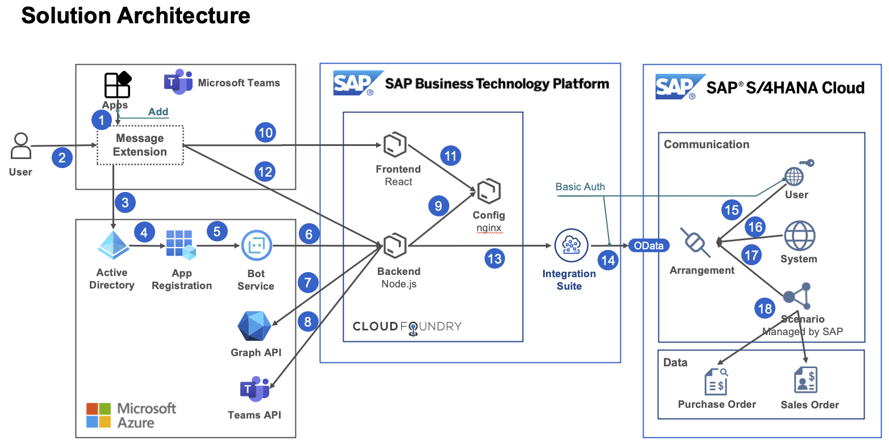

# MS Teams - S/4HANA integration

- [/backend](backend): Flexible backend API server
- [/frontend](frontend): Flexible frontend framework
- [/config](config): Static configuration server
- [/teams-app-package](teams-app-package): Teams app package
- [/ngrok](documentation/ngrok): How to set up ngrok on your local environment

## Architecture

