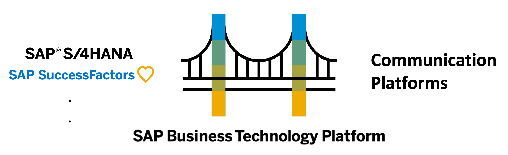

# Bridge Framework – SAP BTP Framework for MS Teams Integrations with SAP

## What is the Bridge Framework?

The Bridge Framework is an integration framework on SAP BTP that **accelerates and simplifies the development experience** for Teams apps that integrate with SAP products.

## Benefits of Bridge Framework

- **Leverage SAP BTP**: Ensure consistency across integrations and leverage the robust integration capabilities of SAP BTP services without a steep learning curve.
- **Ready to Deploy**: Comes packaged with business content and step-by-step guides to drive accelerated deployments.
- **Curated UI Components**: Take advantage of pre-built UI components that integrate seamlessly with Teams.
  Easily use Adaptive Cards, Task Modules, and Notifications.
- **Secure Connections**: Handles principal propagation where supported, encourages use of secure services, such as Destination service, to store credentials.
- **Simple Configurations**: Change content, layout, and functionality on the fly using simple configuration files hosted on SAP BTP.
- **Azure and SAP BTP Automation**: Automates error-prone configuration steps in Azure and SAP BTP using PowerShell and SAP BTP Setup Automator.

## Getting Started

Get your start with the Bridge Framework by checking out our step-by-step guides.

1. [Prerequisites for getting started](./documentation/manual-setup/prerequisites.md)
2. [Automated Setup Guide](./documentation/automation/Automation%20Overview.md)
3. [Bridge Application JSON Configuration](documentation/config/Bridge%20Application%20JSON%20Configuration.md): change the layout and content of your app on the fly.

Optional:

- [Transcript](documentation/manual-setup/transcript/Transcript%20Set%20Up.md): configure automatic transcript fetching and summarization for meetings.
- [Manual Setup Guide](./documentation/manual-setup/manual-setup.md)

## Key Features Added in V2

| Feature                    | Description                                                                                                    |
| -------------------------- | -------------------------------------------------------------------------------------------------------------- |
| Automated set-up           | Automates the configuration and deployment of apps and services on both SAP BTP and Azure                      |
| SuccessFactors support     | Added support for integrating with a SuccessFactors target system via Destination Service or Integration Suite |
| Objects with multiple keys | Business objects accessed by specifying multiple keys can now be displayed                                     |
| New object page components | Images, buttons, and forms can now be added to object pages                                                    |
| Property Grid enhancements | Property grids for business objects can now include dropdowns, text areas, images, and hidden fields           |
| Page context for actions   | Links and buttons can now be tied to user input or page context for more flexible use cases                    |
| Table styling improvements | Tables are now scrollable, can display images, and include more options for changing the styling of rows       |
| Transcript summarization   | Automatic transcript summarization for scheduled meetings can be enabled                                       |

## License
Copyright (c) 2023 SAP SE or an SAP affiliate company. All rights reserved. This project is licensed under the SAP Sample Code License Agreement v1.0 except as noted otherwise in the [LICENSE](LICENSE) file.