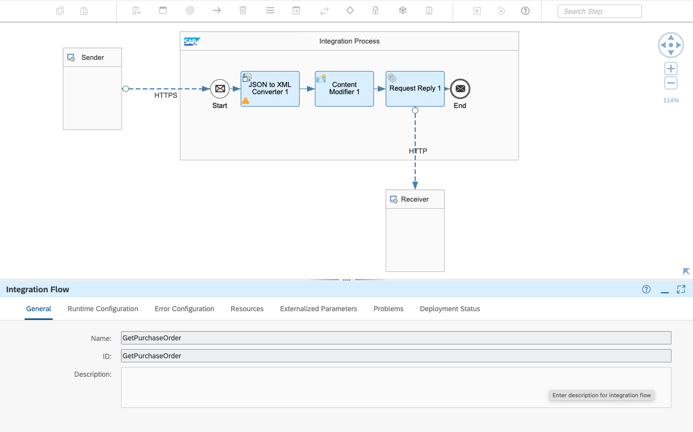
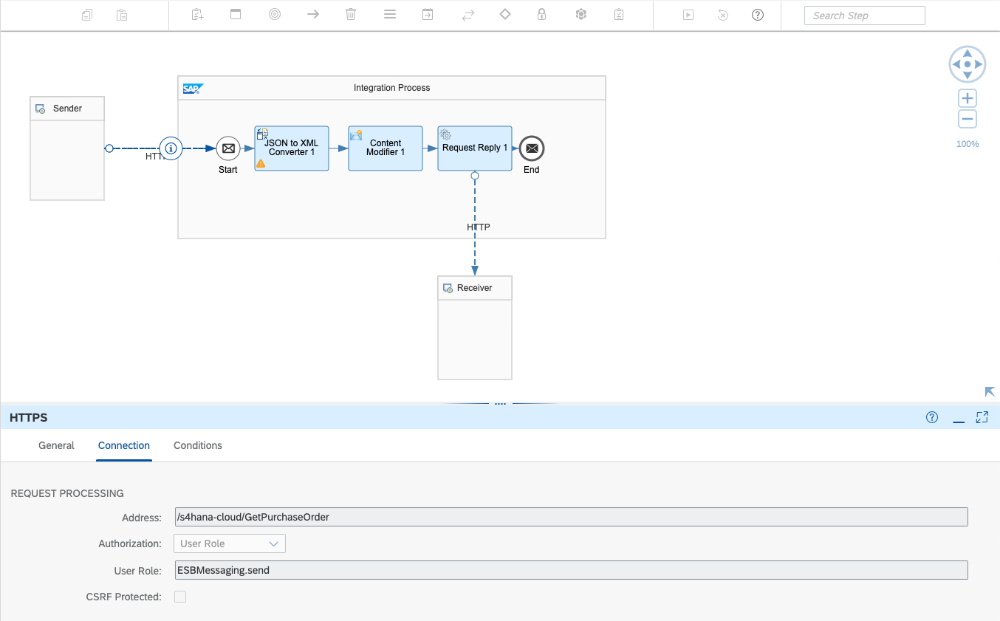
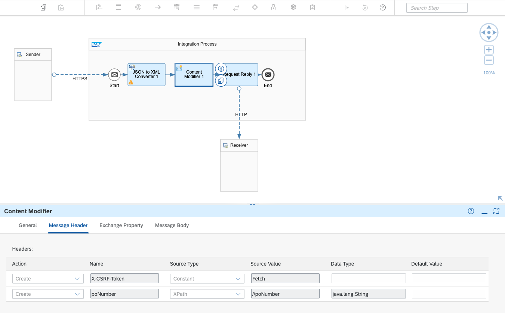
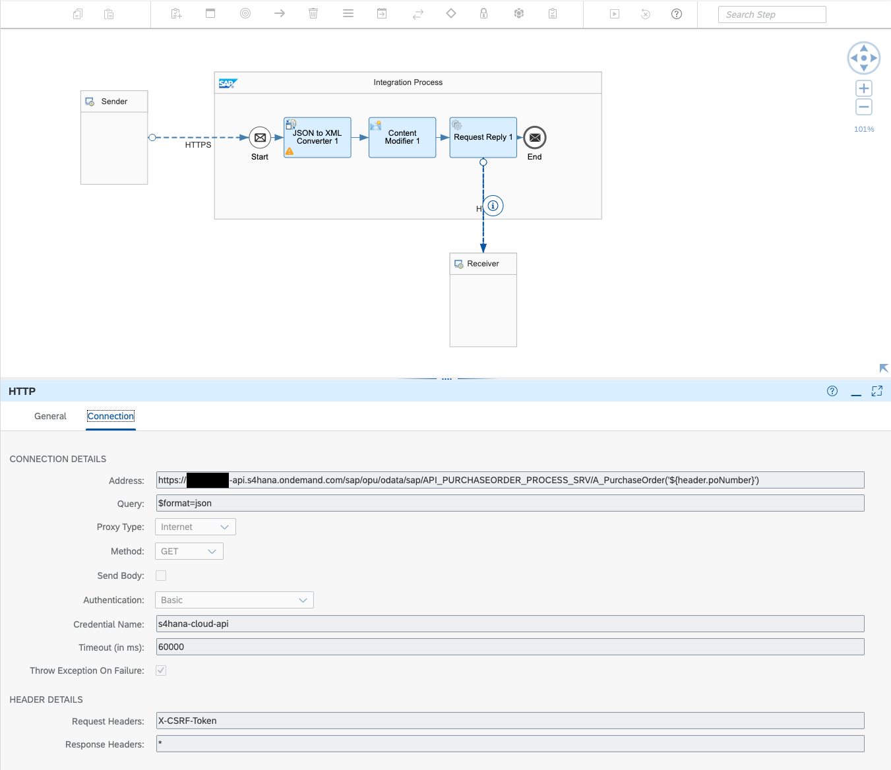

# Backend Configuration

The Bridge Framework provides developers with several different ways to access and integrate Business Objects from SAP Systems.

## objectMappingConfig.json

This file maps specific Interfaces and APIs to Business Objects you want to display in your application.

The file follows a nested structure:

```
{
    "SystemName": {

        "InterfaceName": {

            "BusinessObject": {

            },
            .
            .
            .
        },
        .
        .
        .
    },
    .
    .
    .
}
```

A **System** refers to an SAP product that contains the Business Object you are interested in displaying. Currently, S/4HANA Cloud and On Premise are the first supported Systems.

An **Interface** refers to an API between your app and the System you are interested in accessing. Currently, Integration Suite, SAP Graph, and Destinations are supported Interfaces.

A **Business Object** refers to any object accessible through Interfaces in an SAP System. Currently, many Business Objects in S/4HANA are supported. A specific example of a Business Object could be a Purchase Order or a Company.

## Common Properties

Whether you are using Integration Suite, SAP Graph, or Destinations, you may notice some common properties in the backend configuration. Here they are explained.

- **searchFields:** Fields that can be searched on using the search bar in the custom app's UI. For example, including the field `CompanyCode` means that any search term will try to match results with values from `CompanyCode`. If you exclude, for example `AddressName`, then searching for `3410 Hillview Ave` will not yield any results even though in our example that address is associated with a particular Purchase Order.

- **updateFields:** Fields that can be updated. In the case of a Purchase Order, including the field `PurchasingGroup` means that the `PurchasingGroup` will be a field that can have its value changed from within the custom app. However, it is suggested to **use update functionality sparingly** as Bridge Framework does not implement any business logic to handle complex updates. The values for one field may be tied to values in another field in such a way that makes keeping information updated a challenge.

## Integration Suite

Integration Suite provides users with a lot of flexibility in how to format their data using Integration Flows.

In our example, an Integration Flow for getting a Purchase Order might look something like this:

### Integration Flow Name



### Integration Flow Sender HTTP Configuration



### Integration Flow Content Modifier Configuration



### Integration Flow Receiver HTTP Configuration



The name of the integration flow above `GetPurchaseOrder` is reflected in the `getUrl` property of the `PurchaseOrder`. The `getUrl` is intended to get one particular instance of a purchase order based on the key, which in this case is specified by value `poNumber` in the `iFlowKeys` property. Similarly the `searchUrl` and `updateUrl` correspond to different Integration Flows that handle getting a collection of Purchase Orders and updating values within a Purchase Order respectively.

There are many different ways in which an integration flow can be configured, so the following mapping is only a general example of what your mapping may look like:

```
"IntegrationSuite": {
      "PurchaseOrder": {
        "iFlowKeys": ["poNumber"],
        "searchUrl": "/http/s4hana-cloud/SearchPurchaseOrders",
        "getUrl": "/http/s4hana-cloud/GetPurchaseOrder",
        "updateUrl": "/http/s4hana-cloud/UpdatePurchaseOrder",
        "searchFields": ["PurchaseOrder", "CompanyCode", "Supplier"],
        "updateFields": [
          "PurchasingGroup",
          "PurchasingOrganization",
          "PurchasingProcessingStatus",
          "AddressName",
          "AddressPhoneNumber"
        ]
      },
      "PurchaseOrderItem": {
        "iFlowKeys": ["itemNumber"],
        "searchUrl": "/http/s4hana-cloud/SearchPurchaseOrderItems",
        "getUrl": "/http/s4hana-cloud/GetPurchaseOrderItem",
        "searchFields": ["PurchaseOrderItem"],
      }
}
```

## SAP Graph

Follow a tutorial, such as this one, [SAP Graph Multi-Part Tutorial](https://blogs.sap.com/2021/06/08/sap-graph-multi-part-tutorial-information-map/), to get started with SAP Graph.

In our example, using a Purchase Order and Purchase Order item, the final configuration should look something like this:

```
"Graph": {
      "PurchaseOrder": {
        "url": "https://us10.graph.sap/api/v1/sap.s4/A_PurchaseOrder",
        "searchFields": ["PurchaseOrder", "CompanyCode", "Supplier"],
        "updateFields": [
          "PurchasingGroup",
          "PurchasingOrganization",
          "PurchasingProcessingStatus",
          "AddressName",
          "AddressPhoneNumber"
        ]
      },
      "PurchaseOrderItem": {
        "suffix": "to_PurchaseOrderItem",
        "searchFields": ["PurchaseOrderItem"]
      }
}
```

The `url` property of the Business Objects within `Graph` refers to the SAP Graph endpoint needed to fetch that particular Business Object. In the case of `PurchaseOrder` our endpoint is `https://us10.graph.sap/api/v1/sap.s4/A_PurchaseOrder`. Note that your endpoint will likely be different from ours depending on the region of the subaccount your Graph is deployed in.

You may notice that `PurchaseOrderItem` does not have a `url` property and instead has a `suffix` property. This is due to how SAP Graph constructs endpoints for Business Objects that depend on other Business Objects. In this example, a `PurchaseOrderItem` cannot exist independently from a `PurchaseOrder`, so, by providing a suffix, Bridge Framework will automatically draw the correct connection and fetch the correct Business Object.

## Destination Service

Once your destination has been correctly configured to work with your SAP product of choice, you can create a mapping.

In our example, using a Purchase Order and Purchase Order item, the final configuration should look something like this:

```
"Destination": {
      "PurchaseOrder": {
        "destinationName": "s4hana-cloud-basic-auth",
        "accessToken": false,
        "url": "/API_PURCHASEORDER_PROCESS_SRV/A_PurchaseOrder",
        "searchFields": ["PurchaseOrder", "CompanyCode", "Supplier"],
        "updateFields": [
          "PurchasingGroup",
          "PurchasingOrganization",
          "PurchasingProcessingStatus",
          "AddressName",
          "AddressPhoneNumber"
        ]
      },
      "PurchaseOrderItem": {
        "destinationName": "s4hana-cloud-basic-auth",
        "accessToken": false,
        "url": "/API_PURCHASEORDER_PROCESS_SRV/A_PurchaseOrderItem",
        "suffix": "to_PurchaseOrderItem",
        "searchFields": ["PurchaseOrderItem"]
      }
}
```

The `destinationName` refers to the name of the destination configured in your subaccount. In our case, the destination we configured accesses SAP S/4HANA cloud using basic authentication stored in the destination. For this reason, `accessToken` is set to `false`. However, in a principal propagation scenario, the `accessToken` will need to be set to `true`.

The `url` property of the Business Objects within `Destination` refers to the final part of the endpoint needed to fetch that particular Business Object. In the case of `PurchaseOrder` the endpoint will be constructed by concatenating the endpoint configured.

You may notice that `PurchaseOrderItem` also has a `suffix` property. This property must be added for Business Objects that are dependent on other Business Objects, in this case a `PurchaseOrderItem` cannot exist without a corresponding `PurchaseOrder`.

## Next Steps

Now that you have configured your mappings with the interface(s) of your choice, you can start configuring the application's UI as well following the [Frontend Configuration Documentation](./Frontend%20Config.md).
