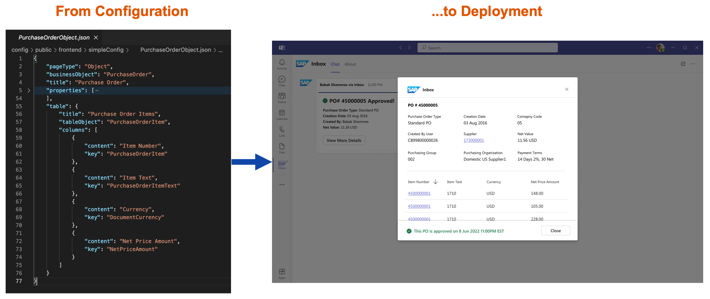

# How to configure your custom Teams application using Bridge Framework.

The Bridge Framework will dynamically generate your custom application based upon configurations specified in JSON files. These JSON files will be hosted on a static server deployed to your subaccount in the Cloud Foundry Runtime.

The configuration for the backend portion of your application will require mapping business objects to their respective APIs and interfaces. The configuration for the frontend portion of your application will require specifying the content and layout for your user interface.

## Getting Started

1. [Backend Config](./Backend%20Config.md) : map business objects to APIs and interfaces
2. [Frontend Config](./Frontend%20Config.md) : specify content and layout for your UI
