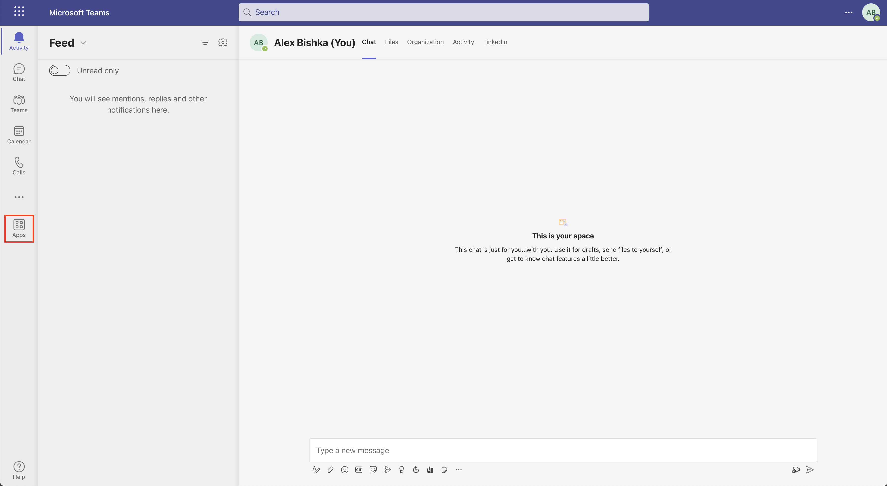
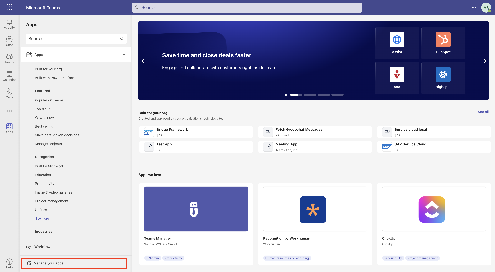
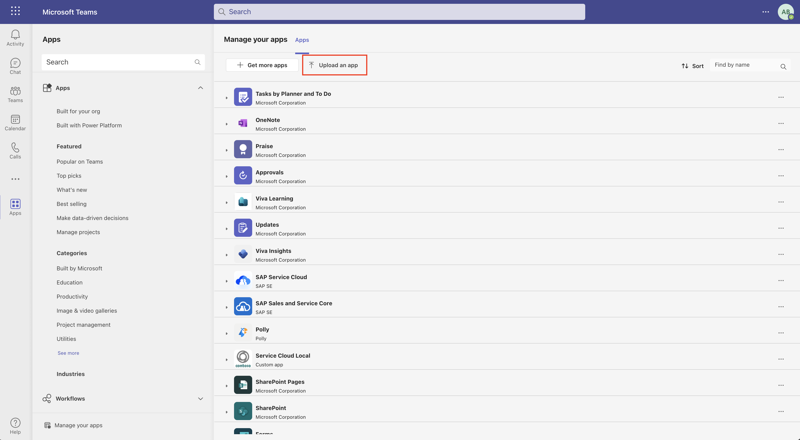
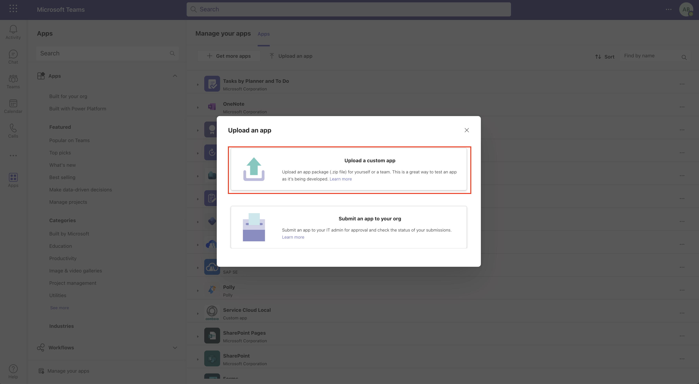
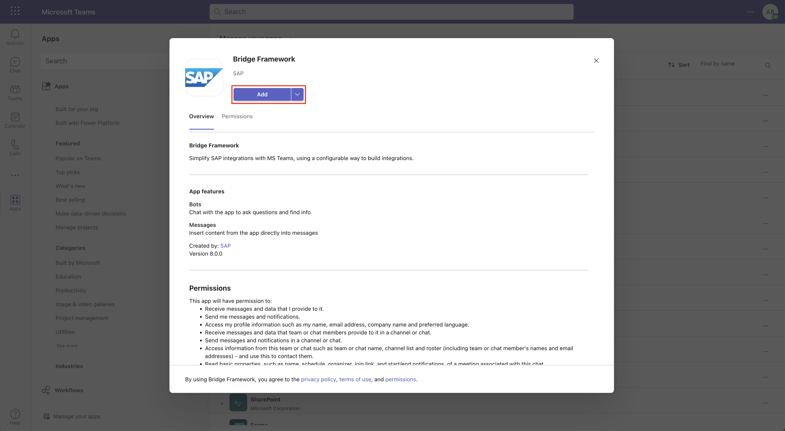
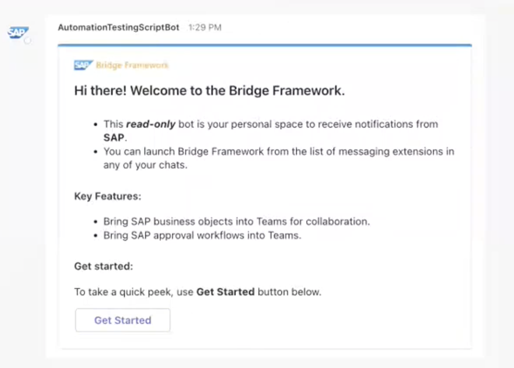
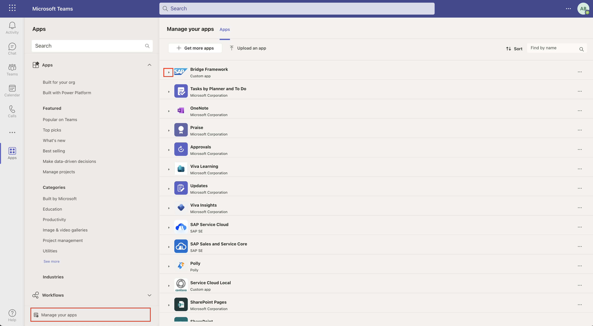
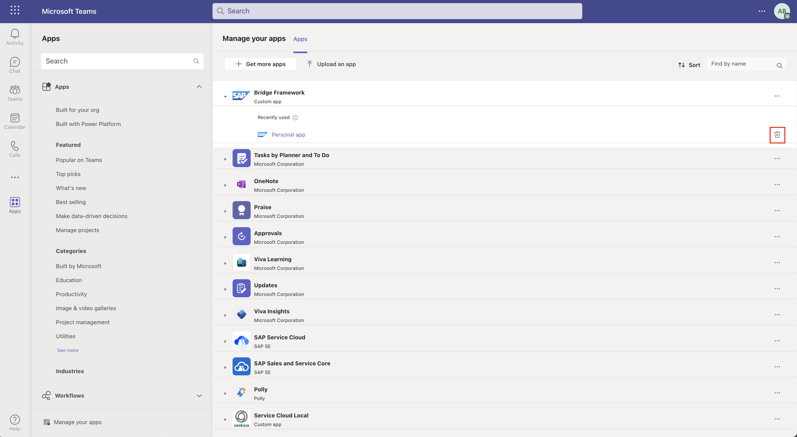
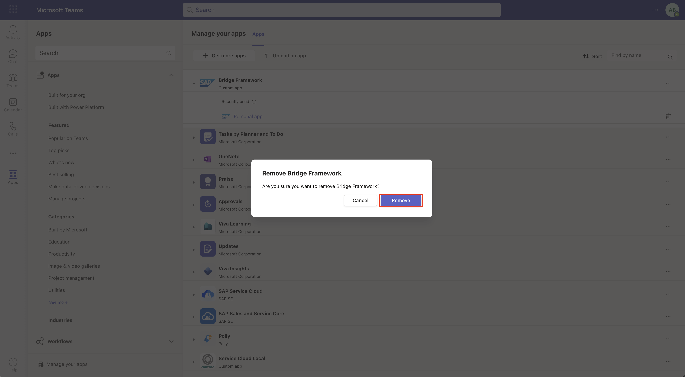

# Bridge Framework Teams Deployment

This section covers how to deploy your application to Microsoft Teams. This guide should be followed if the automated setup tool is not being used, or if the upload to organization feature is not enabled. This option is determined by the Docker container. Free-tier accounts will have this option disabled.

Also see [here](#bonus-remove-app-from-teams) for removing Bridge from Teams.

## Upload and Install your App on Teams

Note that if you used the automated setup method, this zip file will be present for you (in the `teams-app-package/` directory) after the pipeline has completed. Furthermore, depending on what option you selected, it may already be deployed for you as well.

If the automated setup method was not used, please run `./compress-app.sh`, which is located in the `teams-app-pacakge/` directory. Note, you may need to update the permissions of the file, use `chmod u+x ./compress-app.sh` if this is the case.

First, navigate to the teams app package directory: `cd teams-app-package` *(from root)*.

Before uploading your application to Teams you will have to do two things: 1) ensure the manifest.json file is up to date and 2) generate the zip file to upload into teams.

If you would like to use a developer preview for your manifest - please refer to [this guide](./teams-readme/developer-preview.md).

### Manifest Update

The default manifest file for the teams app will look like this:

```
{
  "$schema": "https://developer.microsoft.com/en-us/json-schemas/teams/v1.8/MicrosoftTeams.schema.json",
  "manifestVersion": "1.8",
  "version": "8.0.0",
  "id": "{{Microsoft-Azure-Bot-Service-ID}}",
  "packageName": "com.sap.teams.chat.export",
  "developer": {
    "name": "SAP",
    "websiteUrl": "https://www.sap.com",
    "privacyUrl": "https://www.sap.com",
    "termsOfUseUrl": "https://www.sap.com"
  },
  "icons": {
    "color": "icon-color.png",
    "outline": "icon-outline.png"
  },
  "name": {
    "short": "Bridge Framework",
    "full": "Bridge Framework"
  },
  "description": {
    "short": "Bridge Framework",
    "full": "Simplify SAP integrations with MS Teams, using a configurable way to build integrations."
  },
  "accentColor": "#019CE0",
  "bots": [
    {
      "botId": "{{Microsoft-Azure-Bot-Service-ID}}",
      "scopes": ["team", "personal", "groupchat"],
      "isNotificationOnly": false,
      "supportsFiles": true
    }
  ],
  "composeExtensions": [
    {
      "botId": "{{Microsoft-Azure-Bot-Service-ID}}",
      "canUpdateConfiguration": false,
      "commands": [
        {
          "id": "showDialog",
          "type": "action",
          "title": "Launch Bridge",
          "description": "Launch Bridge Framework",
          "initialRun": false,
          "fetchTask": true,
          "context": ["commandBox", "compose", "message"],
          "parameters": [
            {
              "name": "param",
              "title": "param",
              "description": ""
            }
          ]
        }
      ],
      "messageHandlers": [
        {
          "type": "link",
          "value": {
            "domains": [
              "*.botframework.com",
              "*.hana.ondemand.com",
              "*.cfapps.{{CF_REGION}}.hana.ondemand.com"
            ]
          }
        }
      ]
    }
  ],
  "permissions": ["identity", "messageTeamMembers"],
  "validDomains": [
    "*.githubusercontent.com",
    "*.botframework.com",
    "*.hana.ondemand.com",
    "*.cfapps.{{CF_REGION}}.hana.ondemand.com"
  ],
  "webApplicationInfo": {
    "id": "{{Microsft-Azure-Bot-Service-ID}}",
    "resource": "api://{{FRONTEND_URL}}/botid-{{Microsoft-Azure-Bot-Service-ID}}",
    "applicationPermissions": ["OnlineMeeting.ReadBasic.Chat"]
  }
}
```

You will want to replace all instances of `{{Microsoft-Azure-Bot-Service-ID}}` with the `Microsoft App ID` of your Microsoft Service Bot Id (this can be found in the configuration of a Microsoft Service Bot or alternatively as the `Application (client) ID` of the Bridge application registration), `{{CF_REGION}}` with the Cloud Foundry api region value (this is the region in the Cloud Foundry API Endpoint: `https://api.cf.<CF_REGION>.hana.ondemand.com`), and `{{FRONTEND_URL}}` with the url from your frontend application (it should look something like this: `<frontend-application-name>.cfapps.<cf-api-region>.hana.ondemand.com`). Note that `CF_REGION` and `cf-api-region` are the same value.

### Teams App File Creation

Now we can generate the zip file to upload to Teams by triggering the following script: `./compress-app.sh`. If the script fails to run, you may need to update its permissions: `chmod u+x ./compress-app.sh`. This script should generate the `teams-app.zip` file, which will be uploaded to Teams.

### Teams App File Upload

Note you will need to have a [developer account](https://learn.microsoft.com/en-us/azure/active-directory/verifiable-credentials/how-to-create-a-free-developer-account) before continuing. Navigate to `https://teams.microsoft.com/` and login to your account. On this page you should see a side panel on the left hand side of your screen, with the last button (before `Help`) called `Apps` - click on it:




This should have opened another panel called `Apps`. At the bottom of this panel, you should see a button called `Manage your apps`, please click on it: 



On the new page, select `Upload an app`:



In the new pop-up, select `Upload a custom app`:



Select the zip file you generated earlier from your computer. When the pop-up with Bridge Framework appears, click `Add`:



This will then redirect you to the app, where (if everything has been properly setup and configured) you should see a welcome card like so:



Congrats, you have successfully deployed Bridge! Please enjoy!

## Bonus: Remove App from Teams

Here we will walk you through how to uninstall the Bridge Framework app, should you need to.

Navigate back to the Apps portal from the `Apps` button on the side panel. 

Under `Manage your apps`, find the Bridge Framework App and click on the drop down:



Press the trash can to uninstall the app:



Select `Remove` from the pop-up and you've successfully uninstalled the app:



Note, you may need to clear your cache or logout to let the effects take place immediately.