# **Bridge Framework - Azure Setup**

Steps involved in Bridge Framework - Azure setup:

- [Create Azure AD app registration](#create-azure-ad-app-registration).
- [Create Azure Bot service](#create-azure-bot-service)

&nbsp;

## Create Azure AD app registration

1. Go to your [Azure portal](https://portal.azure.com) and search for **Azure Active Directory**.
   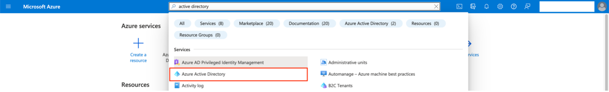

2. In the Active Directory, select **App Registrations** from the side menu and click on **New Registration** button to create a new App Registration.
   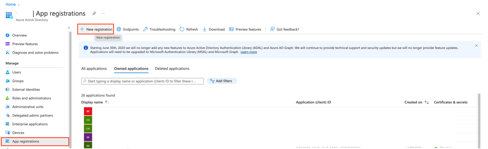

3. Create an App registration using the following configurations.

   - Name = `<str>`; A meaningful name to your app registration.
   - Supported account types = Accounts in any organizational directory (Any Azure AD directory – Multitenant).
   - Redirect URI = `https://token.botframework.com/.auth/web/redirect`

   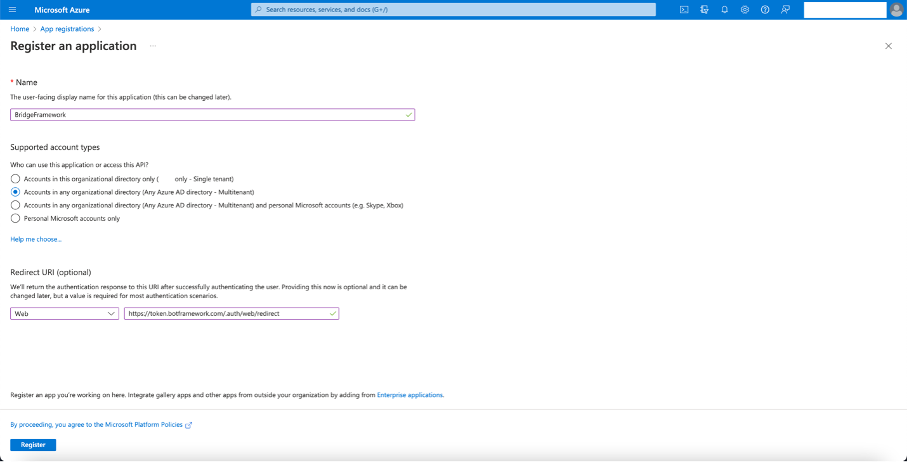

4. In the **Overview** section of the App Registration created, note down the **Application (client) ID** and **Directory (tenant) ID**. These are used as `<microsoft-app-id>` and `<azure-tenant-id>` in various parts of the setup.
   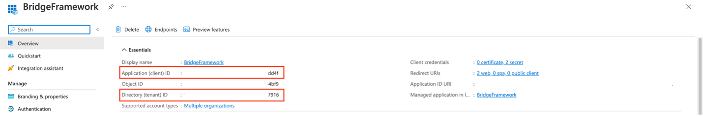

5. Go to the **Authentication** section and add/update the **Redirect URI** in the Web section and enable **Access tokens** (used for implicit flows) for enabling Principal Propagation (Single Sign On) to the app. **Save** the setting using Save button.

   **Syntax:**

   ```
   https://<frontend-app-name>.cfapps.<subaccount-region>.hana.ondemand.com/botid-<microsoft-app-id>
   ```

   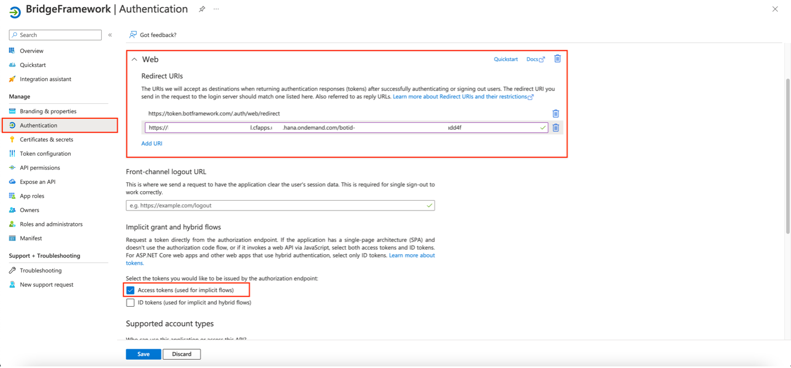

6. Add an app secret in the **Certificates & secrets** section using **New client secret** button and copy the **Value** of the created secret. The value of the client secret created here is used as `<microsoft-app-password>` in different settings.
   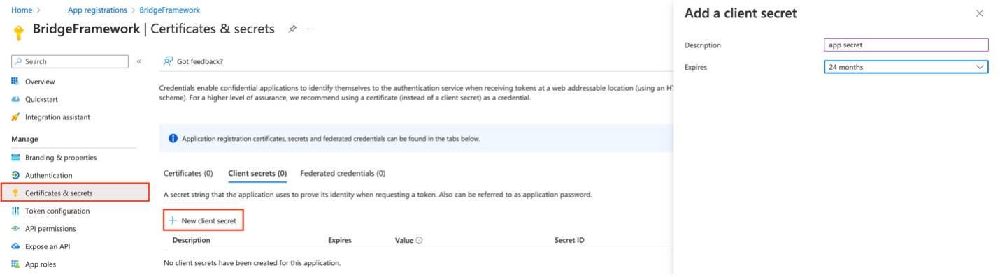

7. Go to **API permissions** section and click on **Add a new permission** button to add the permissions required for a simple app created using Bridge Framework.

   **Note:** Appropriate permissions needs to be added here as the more features are built using the Bridge Framework.

   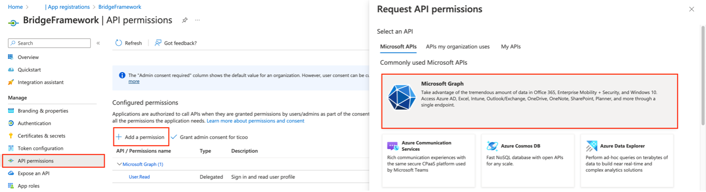

8. In the next menu, select **Delegated permissions** and add the permissions below from the **OpenId permissions** section for the simplest app created using Bridge Framework.

   - email
   - offline_access
   - openid
   - Profile
   - User.Read

   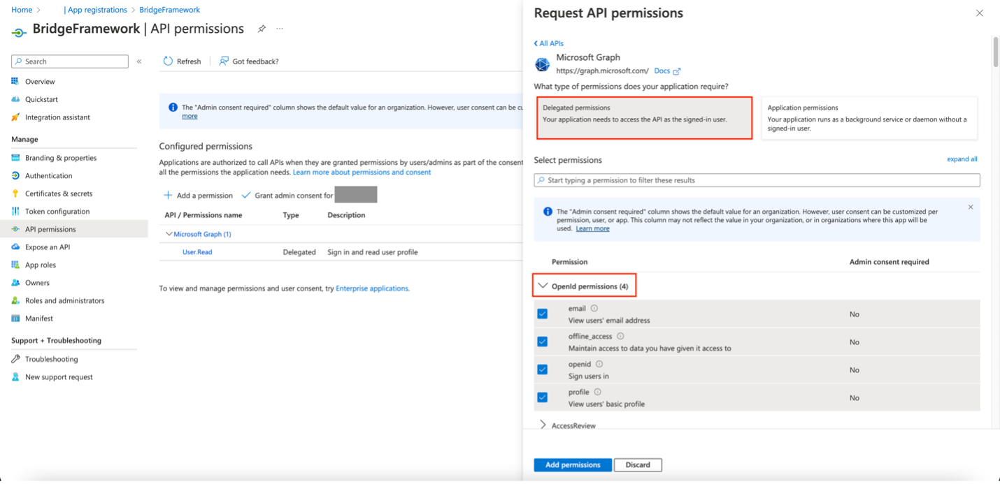

9. Click on **Grant admin consent for …** button to allow the app to use the added permissions.
   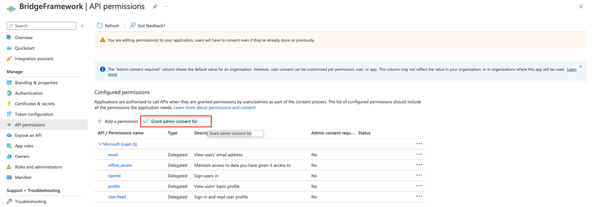

10. Go to **Expose an API** section and set the **App ID URI**.

    **Syntax:**

    ```
    api://<frontend-app-name>.cfapps.<subaccount-region>.hana.ondemand.com/botid-<microsoft-app-id>
    ```

    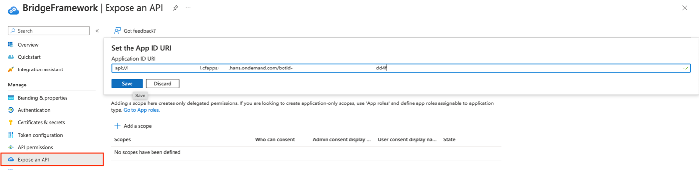

11. Next, add scopes for the app registration using **Add a scope** button.

    - Scope name = access_as_user
    - Who can consent = Admins and users
    - Admin consent display name = Teams can access user profile.
    - Admin consent description = Allows Teams to call app’s web APIs as the current user.
    - User consent display name = Teams can access your user profile and make requests on your behalf.
    - User consent description = Enable Teams to call this app’s APIs with the same rights that you have.
    - State = Enabled.

    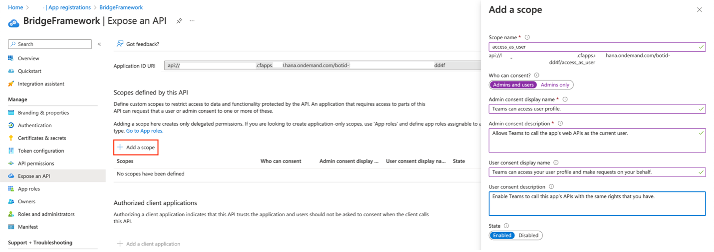

12. Add another Scope for SCP access using the configurations below.

    - Scope name = scp.access
    - Who can consent = Admins and users
    - Admin consent display name = SCP Access
    - Admin consent description = SCP Access
    - State = Enabled

    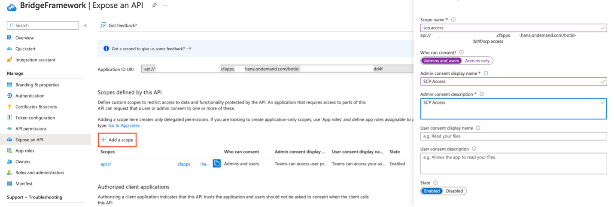

13. Add the below two client applications enabled with the above two scopes, for your custom apps to work with Microsoft Teams Desktop and Web applications.

    ```
    5e3ce6c0-2b1f-4285-8d4b-75ee78787346
    1fec8e78-bce4-4aaf-ab1b-5451cc387264
    ```

    Enable two Authorized scopes and click on Add application.

    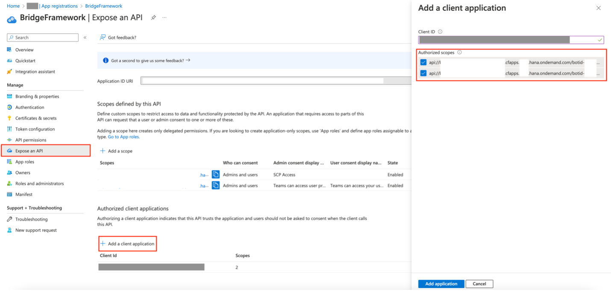

14. Go to **Manifest** section and update the **accessTokenAcceptedVersion** to **2**.
    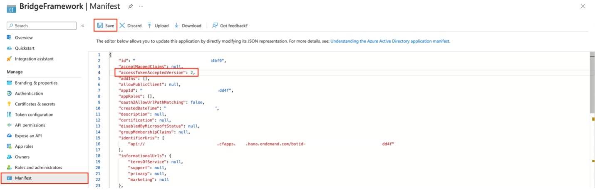

15. Find the App Registration of the Enterprise application created previously, under **All Applications** section in the **Azure Active Directory > App Registrations**.
    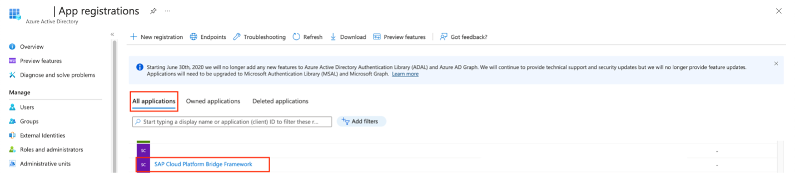

16. Under the Enterprise Application app registration, go to **Expose an API** section and register the **BridgeFramework** application by entering its client id `<microsoft-app-id>` noted in step 4, by clicking on **Add a client application**. Enable the _Authorized scopes_ in the form.
    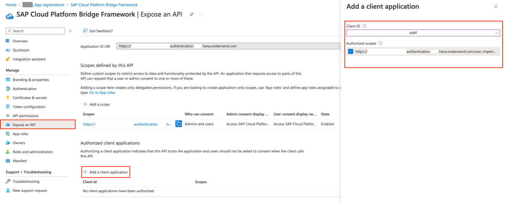

&nbsp;

## Create Azure Bot service

1.  In your Azure portal, search for **Azure Bot** to create the bot required by the **BridgeFramework**.
    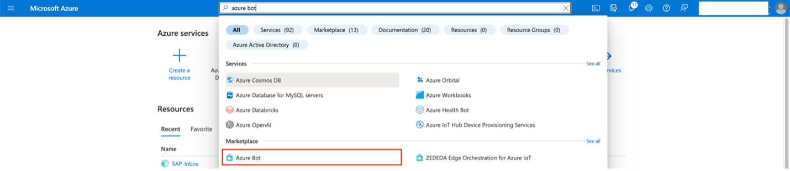

2.  Create the Azure bot using the values below.

    - Bot handle = `<str>`; Example: BridgeFramework
    - Subscription = Your Azure subscription – select from dropdown.
    - Resource group = Your resource group – select from dropdown.
    - Pricing tier = Free.
    - Type of App = Multi Tenant.
    - Creation type = Use existing app registration.
    - App ID = `<microsoft-app-id>` noted in _Section 1 > step 4_.

    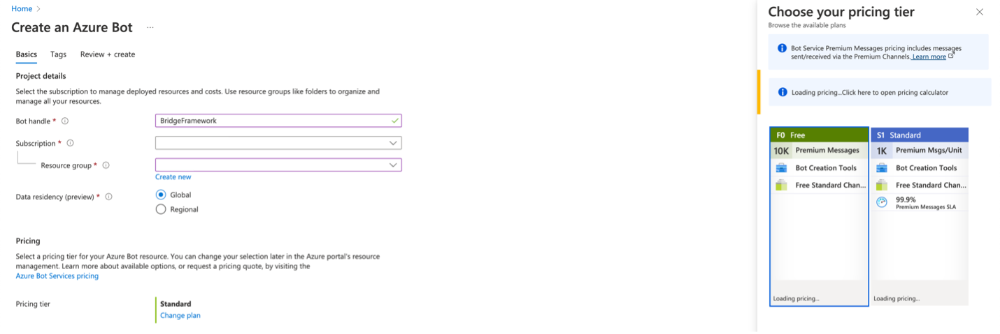
    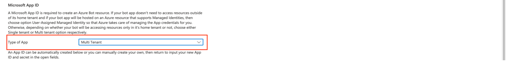
    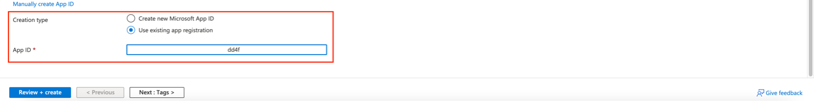

3.  Go to the created Bot resource and under **Configuration** section, add the messaging endpoint in the below format.

    **Syntax:**

    ```
    https://<backend-app-name>.cfapps.<subaccount-region>.hana.ondemand.com/api/messages
    ```

    `<backend-app-name>` can be found in **manifest.yaml** file in BridgeFramework’s **/backend** folder.

    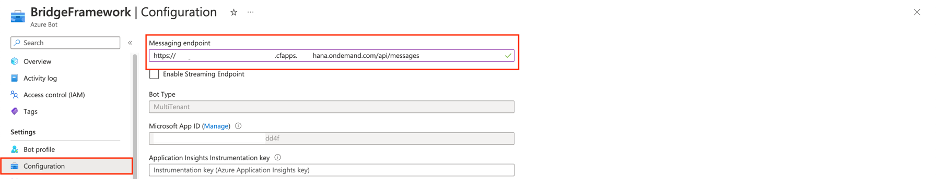

4.  Add an Oauth Connection using the **Add OAuth Connection settings** button and use the below values.

    - Name = `<str>`; Example: GraphConnection
    - Service Provider = Azure Active Directory v2
    - Client id = `<microsoft-app-id>` noted in **Section 1 > step 4**.
    - Client secret = `<microsoft-app-password>` noted in **Section 1 > Step 6**.
    - Token Exchange URL =
      ```
      api://<frontend-app-name>.cfapps.<subaccount-region>.hana.ondemand.com/botid-<microsoft-app-id>
      ```
    - Tenant ID = `<azure-tenant-id>` noted in **Step 1 > Step 4**.
    - Scopes =

      ```
      api://<frontend-app-name>.cfapps.<subaccount-region>.hana.ondemand.com/botid-<microsoft-app-id>/scp.access api://<frontend-app-name>.cfapps.<subaccount-region>.hana.ondemand.com/botid-<microsoft-app-id>/access_as_user
      ```

      (Each scope URI is separated by space)

    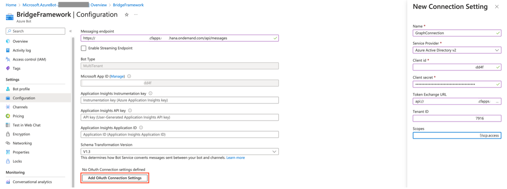

5.  Test the added connection using **Test Connection** button and verify that the connection is successful.
    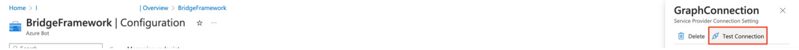
    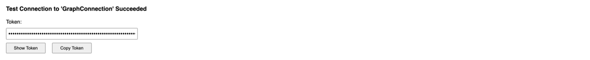

6.  Add **Microsoft Teams Channel** to the bot resource under **Channels** section to enable the bot to interact with Microsoft Teams.
    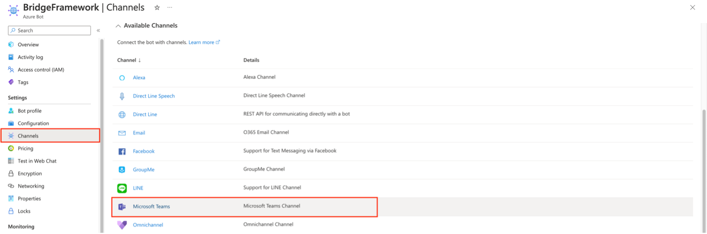
    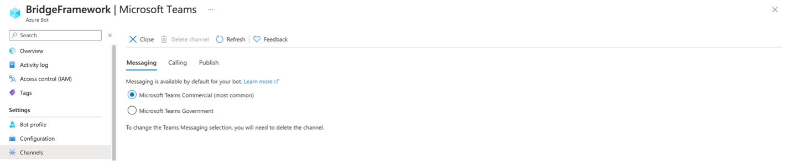
    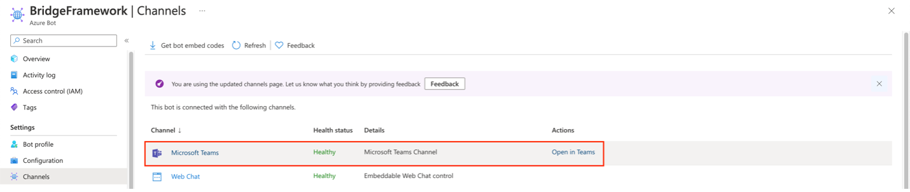
