## Establish BTP - Azure Trust

1. Go to your SAP BTP subaccount and download the SAML Metadata under Security > Trust Configuration.
   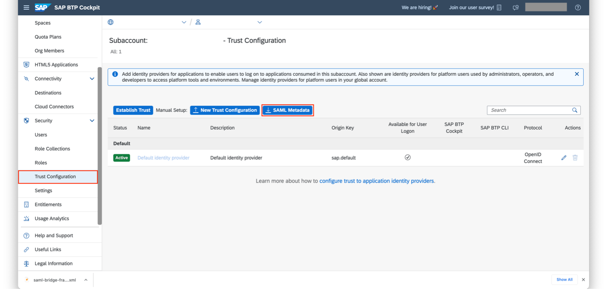

2. Then, go to Microsoft Azure portal and search for Enterprise Applications in the search bar. Select the Enterprise applications under Services.
   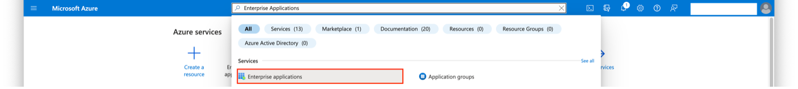

3. Create a new enterprise application by clicking on the New Application button.
   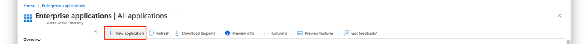

4. Search for SAP Cloud Platform enterprise application in Azure AD gallery.
   

5. Give an appropriate name for the registration and click on Create.
   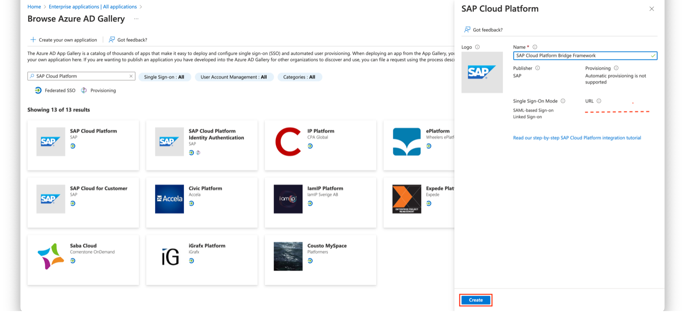

6. In the newly created enterprise application, go to Single sign-on and select the SAML tile.
   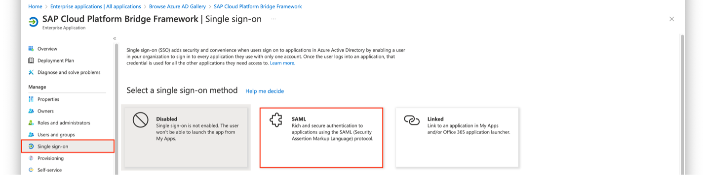

7. Click on the _Upload metadata file_ button and upload the SAML metadata file downloaded in step 1.
   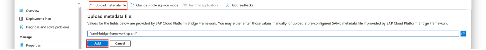

8. Edit the _Basic SAML configuration_ and edit the Reply URL to change the part **/saml/sso/** into **/oauth/token/**.
   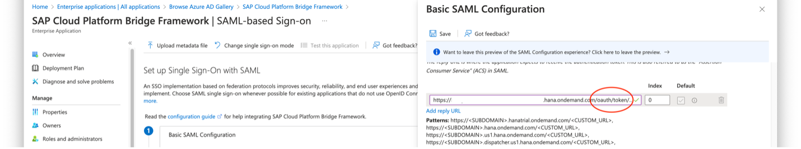

9. Add the Sign on URL in the format `https://<btp-subaccount-name>.authentication.<subaccount-region>.hana.ondemand.com`.
   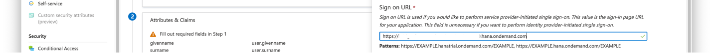

   **Note:** The above sign on URL can also be found on the url attribute of the service key created within the XSUAA instance bound to the Bridge Framework’s backend application.

   You may test the Single sign-on using the pop up which shows up upon saving the SAML Configuration.

10. Edit the Attributes & Claims section and change the _Unique User Identifier_ from user.userprincipalname into **user.mail**. Save the settings.
    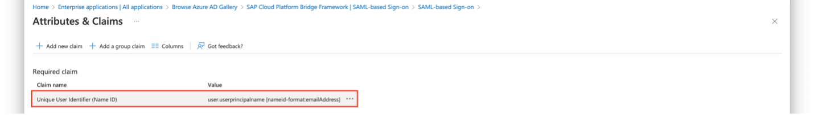
    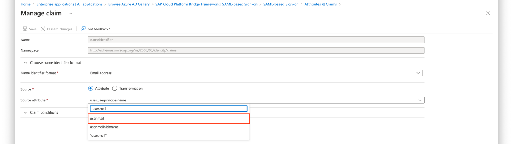

11. Download the _Federation Metadata XML_.
    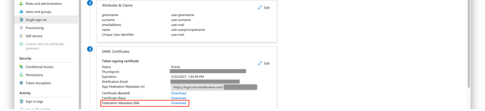

12. Go to your BTP subaccount and under **Security > Trust Configuration** section, upload the _Federation Metadata XML_ file downloaded in step 11, by clicking _New Trust Configuration_ button.
    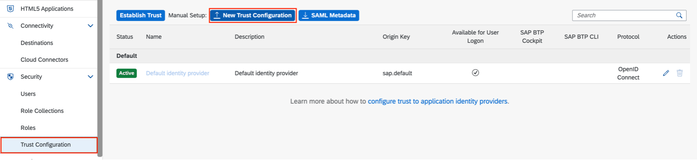

13. Give the trust configuration an appropriate _Name_ and disable _Available for User Logon_ option. Click on **Save**. (Link text for user logon could be same as origin key).
    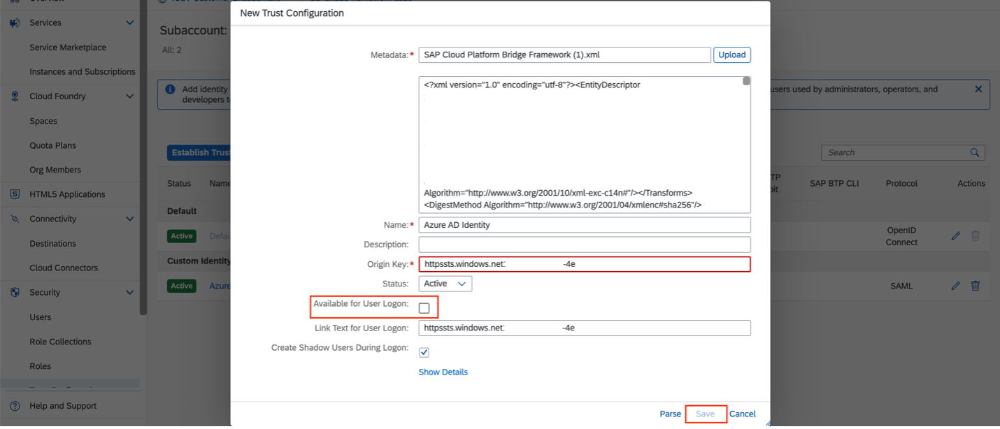

&nbsp;
