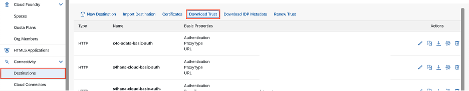
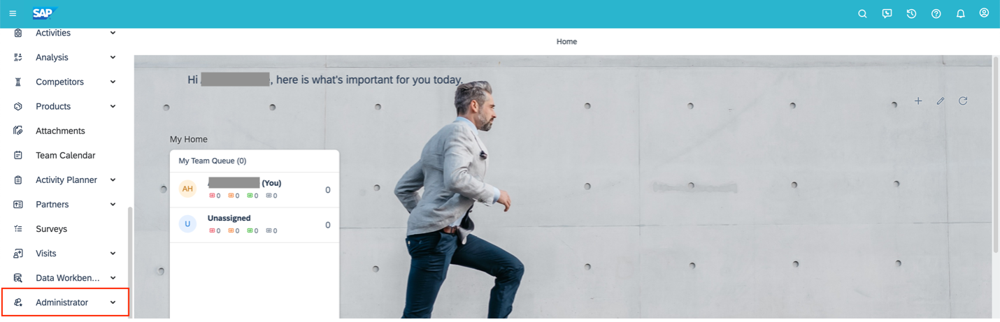
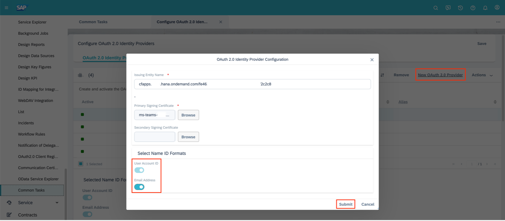
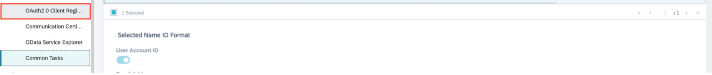
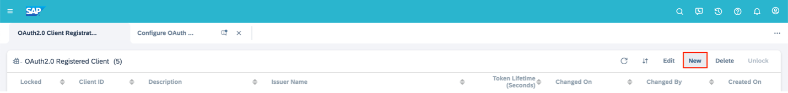
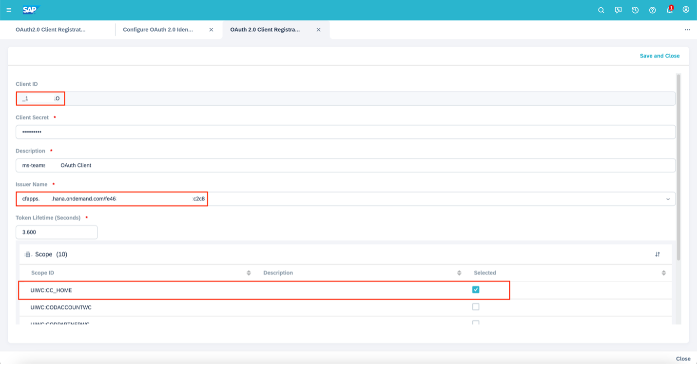
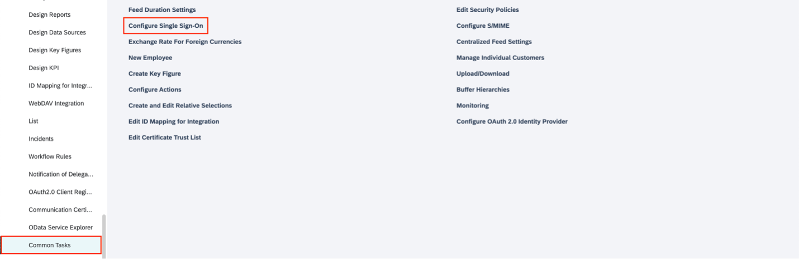
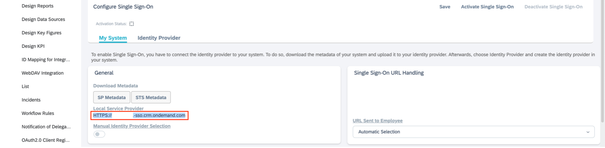

# **Bridge Framework - SAP Cloud for Customer Principal Propagation**

Steps involved in establishing principal propagation between Bridge Framework and SAP S/4HANA:

1. [Establish trust between SAP BTP and Microsoft Azure](./btp-azure-trust.md).
2. [Establish trust between SAP BTP and SAP Cloud for Customer (C4C)](#establish-btp---c4c-trust).
3. [Create a destination on SAP BTP](#create-sap-btp-destination-service).

&nbsp;

## Establish BTP - C4C trust

1. Go to your SAP BTP subaccount and download the trust certificate for the subaccount under **Connectivity > Destinations** using **Download Trust** button.
   

2. Open the certificate in a text editor, copy the content between **-----BEGIN CERTIFICATE-----** and **----- END CERTIFICATE-----** (excluding these tags), and save it in a file with the following format:

   `<subaccount-subdomain>_signing.cer`

   `<subaccount-subdomain>` is the Subaccount Subdomain which can be found in the **Overview** section of your subaccount.

   **Ex:** teams-integration-subaccount_signing.cer

3. Log in to your SAP C4C (Cloud for Customer) tenant and add a new **OAuth Identity Provider** under **Administrator > Common Tasks > Configure OAuth 2.0 Identity Provider** section using **New OAuth 2.0 Provider** button.

   - **Issuing Entity Name:**
     `cfapps.<subaccount-region>.hana.ondemand.com/<subaccount-id>`

     Ex: `cfapps.us20.hana.ondemand.com/ab123456-1234-5678-9012-2d96a4123456`

   - **Primary Signing Certificate:** Upload the certificate saved in **Section 2 > Step 2**.
     Ex: teams-integration-subaccount_signing.cer

   - **Select Name ID Formats:** Select **User Account ID** and **Email** options.
   - Choose **Submit**.

   Note: `<subaccount-region>` is the region of your subaccount usually found in the API Endpoint value in the Overview section of your BTP subaccount.

   
   
   

4. Register a new OAuth 2.0 client under **Administrator > OAuth 2.0 Client Registration**.

   - Use **New** button to add a new OAuth 2.0 client.
   - Note down the pre-populated Client ID of the new registration which is later required to set up Destination service in BTP.
   - **Client Secret:** `<str>;` Preferably an alphanumeric string. Note down the password.
   - Description: `<str>;` Meaningful description.
   - Issuer Name: Select OAuth 2.0 Identity Provider created in **Section 2 > Step 3.**
   - Token lifetime: 3.600 (3600 seconds default value).
   - Scope: `UIWC:CC_HOME`
   - Save and Close.

   
   
   

&nbsp;

## Create SAP BTP destination service

1. Go to your BTP subaccount and create a new Destination service under Connectivity > Destinations using New Destination option.

   - **Name:** `<str>;` Meaningful name for your C4C destination.
   - **Type:** HTTP
   - URL: URL to your C4C Tenant.
     Ex: `https://mydomain123.crm.ondemand.com`
   - **Proxy Type:** Internet.
   - **Authentication:** OAuth2SAMLBearerAssertion
   - **Audience:** **Local Service Provider** URL under **Administrator > Common Tasks > Configure Single Sign-On > My System**.
     Ex: `HTTPS://my12345-sso.crm.ondemand.com`
     
     

   - **AuthnCintextClassRef:** `urn:none`
   - **Client Key:** Client ID of the OAuth 2.0 Client noted in **Section 2 > Step 4 > Sub-step b**.
   - **Token Service URL:**
     `https://<c4c-domain>.crm.ondemand.com/sap/bc/sec/oauth2/token`

     Ex: `https://my1234.crm.ondemand.com/sap/bc/sec/oauth2/token`

   - **Token Service User:** Same as **Client Key**.
   - **Token Service Password:** Password created in **Section 2 > Step 4 > Sub-step 3**.

     **Additional Properties:**

   - **userIdSource:** `email`
   - **nameIdFormat:** `urn:oasis:names:tc:SAML:1.1:nameid-format:emailAddress`
   - **scope:** `UIWC:CC_HOME`
   - Check Use default JDK truststore.
   - Click on **Save**.
   - Verify the connection using **Check Connection** button.

   
