# **Bridge Framework - SAP S/4HANA Principal Propagation**

Steps involved in establishing principal propagation between Bridge Framework and SAP S/4HANA:

1. [Establish trust between SAP BTP and Microsoft Azure](./btp-azure-trust.md).
2. [Establish trust between SAP BTP and SAP S/4HANA on-premise system](#establish-btp---s4hana-trust).
3. [Create a destination on SAP BTP](#create-sap-btp-destination-service).

&nbsp;

## Establish BTP - S/4HANA trust

1.  Login to your cloud connector Administration console and connect your BTP subaccount by clicking on the _Add Subaccount_ button. Enter the details below and click on Save.

    - Region = Region of your SAP BTP subaccount.
    - Subaccount = ID of your SAP BTP subaccount.
    - Display name = `<str>`; A meaningful name.
    - Login E-mail = Email used to sign into SAP BTP.
    - Password = SAP BTP user password.

    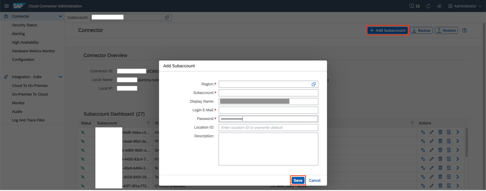

    **Note:** BTP subaccount information is found on the subaccount Overview page.
    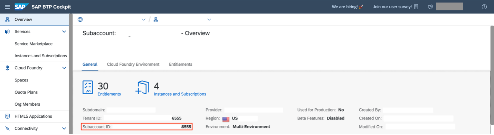

2.  Switch to the newly added subaccount and create and import the self-signed System Certificate by going to **Configuration > ON PREMISE** and clicking on **Create and Import a self-signed certificate** button under **System Certificate** section.
    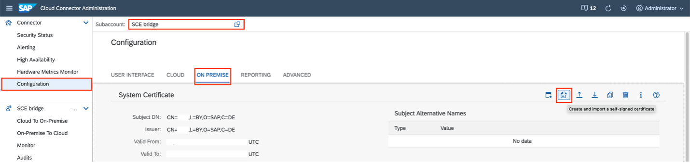
    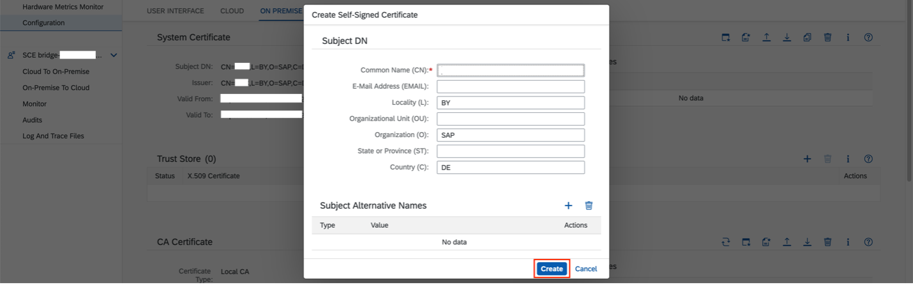

3.  Download the generated System certificate by using **Download certificate in DER format** button.
    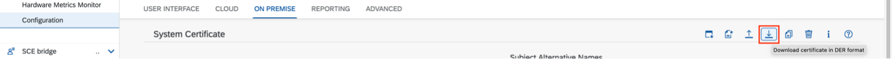

4.  Create and import a self-signed CA Certificate by using **Create and import a self-signed certificate** button under _CA Certificate_ section.
    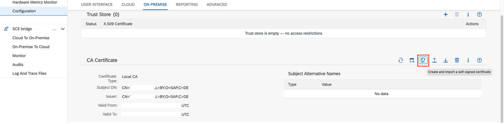
    

5.  Download the generated CA certificate by using **Download certificate in DER format** button.
    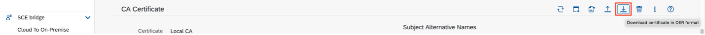

6.  Edit the _user mapping sample certificate_ by using the **Edit** button under **Principal Propagation** section.

    - Common Name = ${email}
    - Expiration Tolerance (h) = 2
    - Certificate Validity (min) = 60

    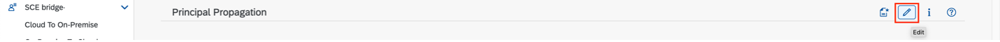
    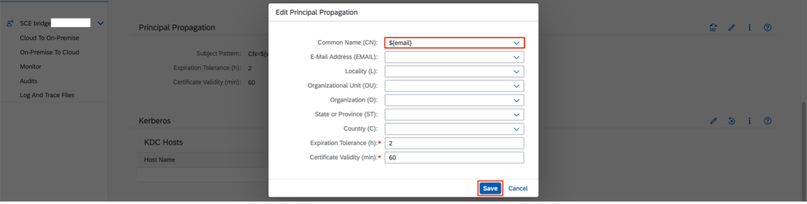

7.  Create a _user mapping sample certificate_ under Principal Propagation section by using **Create a sample certificate** button.
    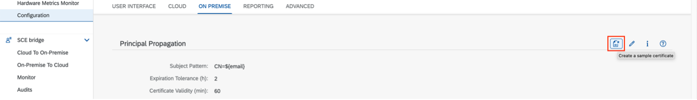

8.  Enter an email which is registered under a user in SAP S/4HANA on-premise system and click on **Generate** button. A sample mapping certificate will be downloaded.
    

9.  Under the _Cloud to On-Premise_ section go to _PRINCIPAL PROPAGATION_ section and click on **Synchronize** button to obtain the list of IdPs.
    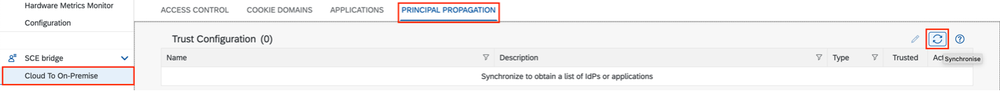

10. Add a mapping from virtual to internal system by clicking on + button under _Cloud to On-Premise > ACCESS CONTROL_.
    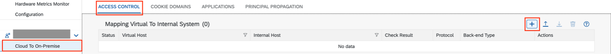

    Add the following values is the subsequent dialogs:

    - Back-end Type = ABAP System
    - Protocol = HTTPS
    - Internal Host = External IP Address of the SAP S/4HANA system. (**SAP S/4HANA 2020 FPS02 & SAP HANA DB 2.0 External IP Address** found under **Appliances > Info** section in _Cloud Application Library console_.)

    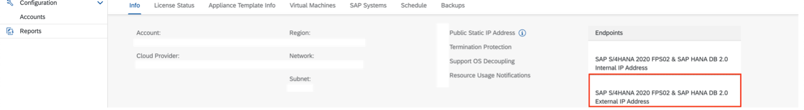

    - Internal Port = Port number. Example: 44300.
    - Virtual Host = `<str>`; Example: s4hanaonprem.
    - Virtual Port = Port number. Ex. 44300.
    - Principal Type = X.509 Certificate (General Usage).
    - Host in Request Header = Use Virtual Host.
    - Enable **Check Internal Host** checkbox.

    &nbsp;
    Click on Finish.

    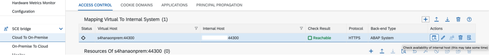

11. Add resources of the virtual host by using + button. Set the URL Path to / and click on **Save**.
    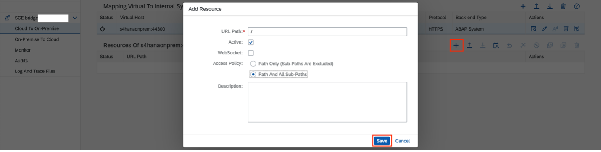

12. Login to your SAP S/4HANA on-premise system using **SAP GUI for Java**. Use the transaction code **STRUST** to go to the **Trust Manager**.
    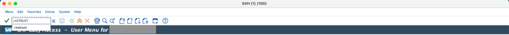

13. In the Trust manager screen import and add the System Certificate created in step 2, by following the steps below.

    - Click on **Display <-> Change** button to enable editing.
    - Go to **SSL server Standard > System-wide > vhcals4hci_S4H_00**.
    - Click the **Import Certificate** button and import the System Certificate created in step 2.
    - Click on the Add to **Certificate List** button to register the system certificate. You can verify the newly added certificate under the _Certificate List_ section.
    - Copy the **Subject** filed under the Certificate section and **note it down** for later use.
      - **Note:** It is important to copy and note the Subject field **EXACTLY** as it appears on the Certificate section on the Trust Manager screen to avoid errors in the reverse proxy trust configuration.
    - Click on the **Save** button to save changes.

    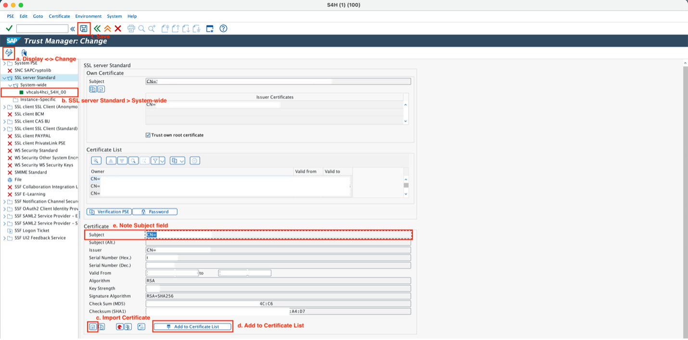

14. Use the transaction code **å** to go to the _Rule Based Certificate Mapping_.
    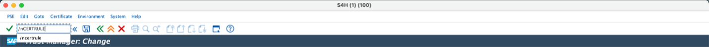

15. In the **Rule Based Certificate Mapping** screen, import the _user mapping sample certificate_ created in **step 7**, by following the steps below.

    - Click on **Display <-> Change** button to enable editing.
    - Click the **Import Certificate** button and import the user mapping sample certificate created in _step 7_.
    - Click on **+ Rule** button to add the rule.

    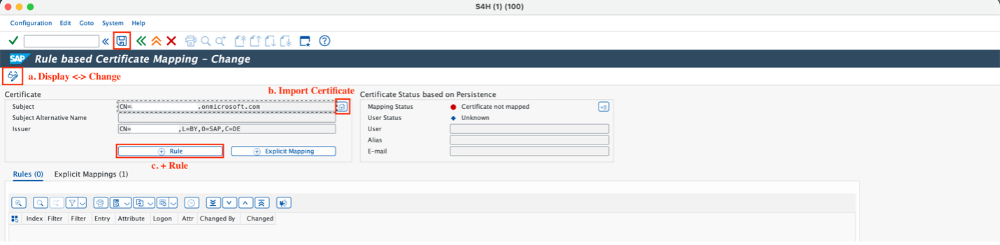

    - Select the **Certificate Attr.** as the **email address** from the dropdown.
    - Select the attribute **Login As**, as **E-mail**.
    - Click on the **Enter** button to create the rule.

    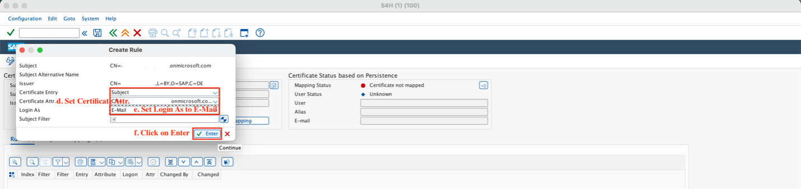

    - Click on the **Save** button to save all changes. Observe that the mapped email exists in the SAP S/4HANA on-premise system.

    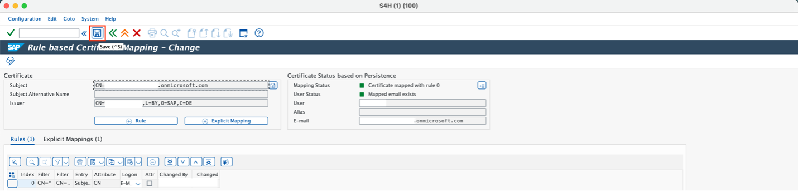

16. Use transaction **RZ10** to go to **Edit Profile** screen.
    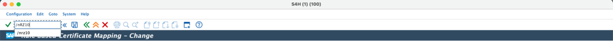

17. Select the **ACTIVE** profile from the list. Name of the active profile in the system can be found on the system trace (log files).
    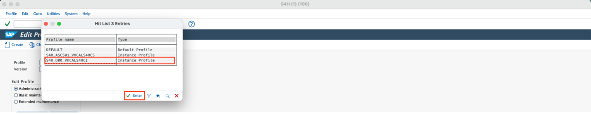

    **Note:** **Default** profile may be active in the SAP S/4HANA system by default. Check your system logs for the current active profile.

18. Select **Extended maintenance** and click on the **Change** button.
    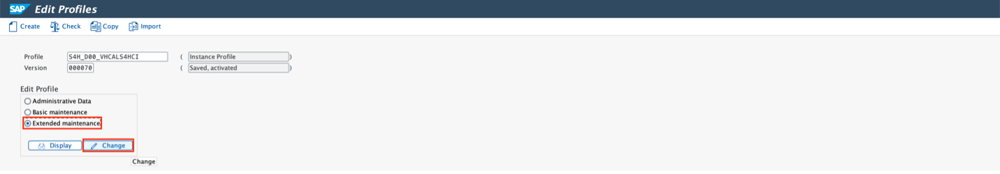

19. Click on the **Create Parameter** button to add the reverse proxy trust configuration.
    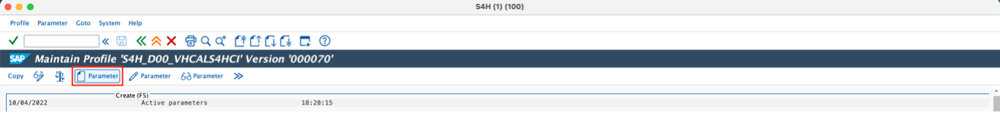

20. Add the parameter name `icm/trusted_reverse_proxy_0` and the parameter value `SUBJECT=“CN=<CN-NAME>, <remaining-fields-from-subject>”` `ISSUER=“CN=<CN-NAME>, <remaining-fields-from-issuer>”`.

    **Syntax:**

    ```
    Parameter Name = icm/trusted_reverse_proxy_(n)
    Where (n) = 0, 1, 2 … (whole numbers)

    Parameter Value = SUBJECT=“<Subject-String>” ISSUER=“<Issuer-String>”
    ```

    **Important:**
    `<Subject-String>` and `<Issuer-String>` must be EXACTLY same as it appears in step 13 (including quotes, spaces etc.).

    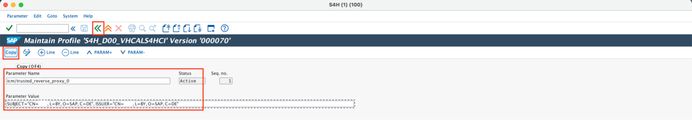

    Click on **Copy** to save the parameter and go back to the profile maintenance screen. In the profile maintenance screen, click on the **Copy** button again to save the new parameter into the profile.

21. Go back to the profile screen and click on the **Save** icon to activate the profile with reverse trust proxy configuration.
    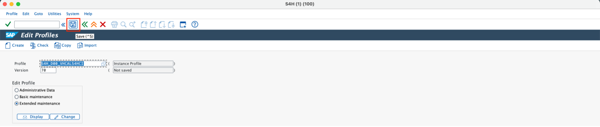

22. Profile will be activated upon restarting the system. To restart the system, go to the transaction **SMICM**.
    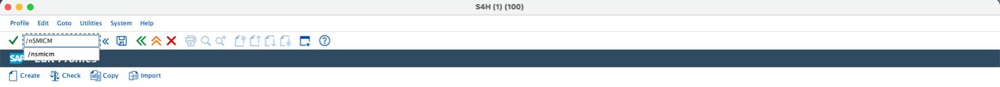

23. In the _ICM monitor_ screen, select **Administration > ICM > Exit Soft > Global** to restart the system.
    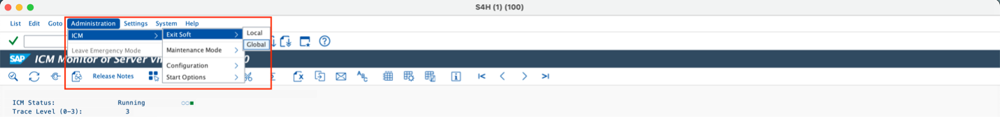

&nbsp;

## Create SAP BTP destination service

1. In your BTP subaccount, go to **Connectivity > Cloud Connector** and verify that the Cloud Connector instance created in _section 2_ is registered.
   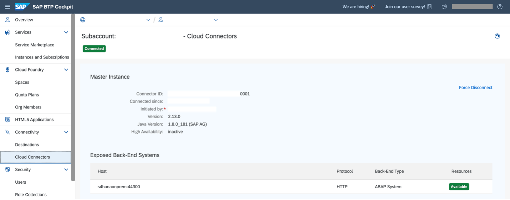

2. Add a destination in **Connectivity > Destinations** section, using **New Destination** icon.

   - Name = `<str>`; A meaningful name to your destination.
   - Type = HTTP
   - URL = http://<virtual-host>:<virtual -port> (created in _Section 2 > Step 10_)
   - Proxy Type = OnPremise
   - Authentication = PrincipalPropagation

   - Additional properties
   - sap-client = 100
   - sap-platform = ABAP
   - sap-sysid = S4H

   Click on **Save**.

   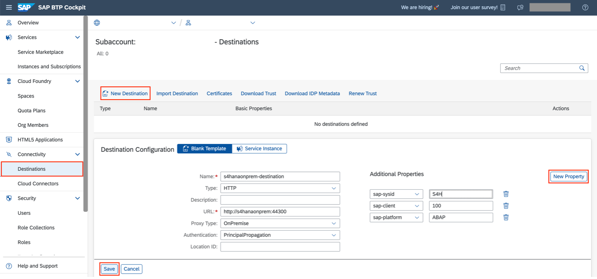

3. Check the connection to the destination service using either of the highlighted buttons and verify that the connection is successful.
   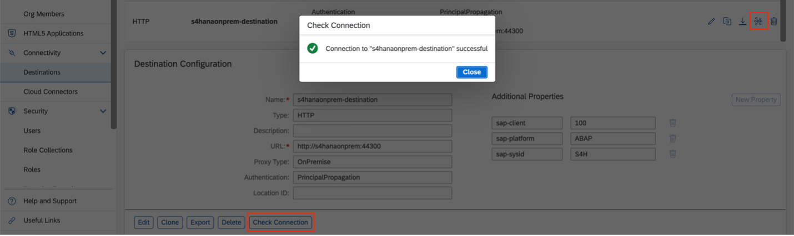
