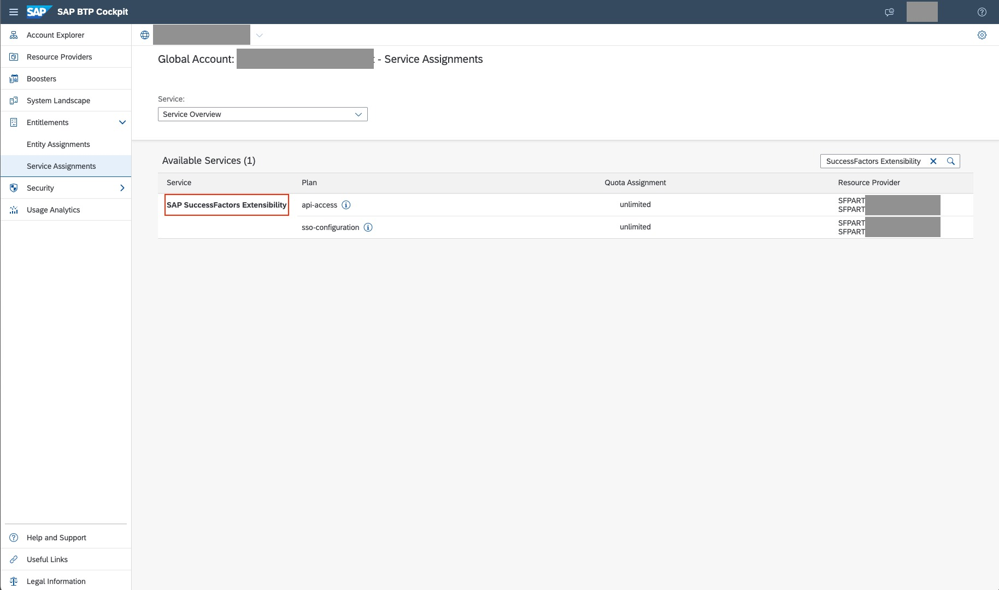
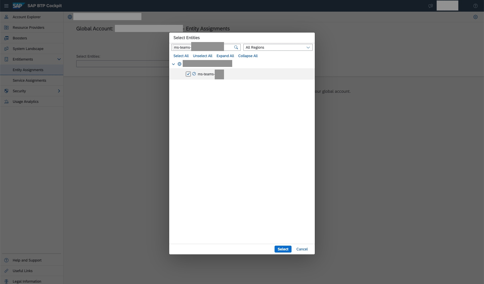
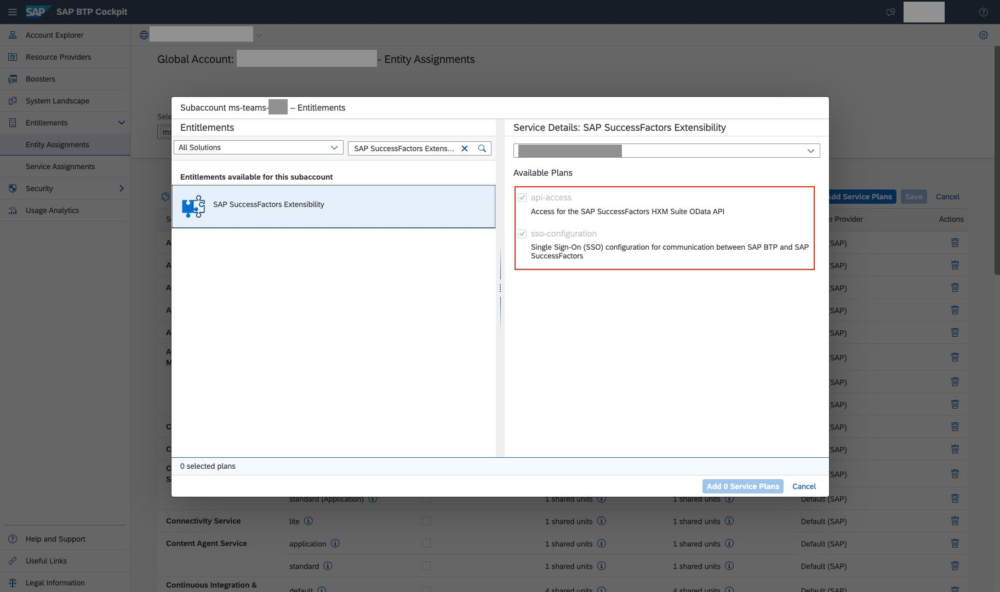
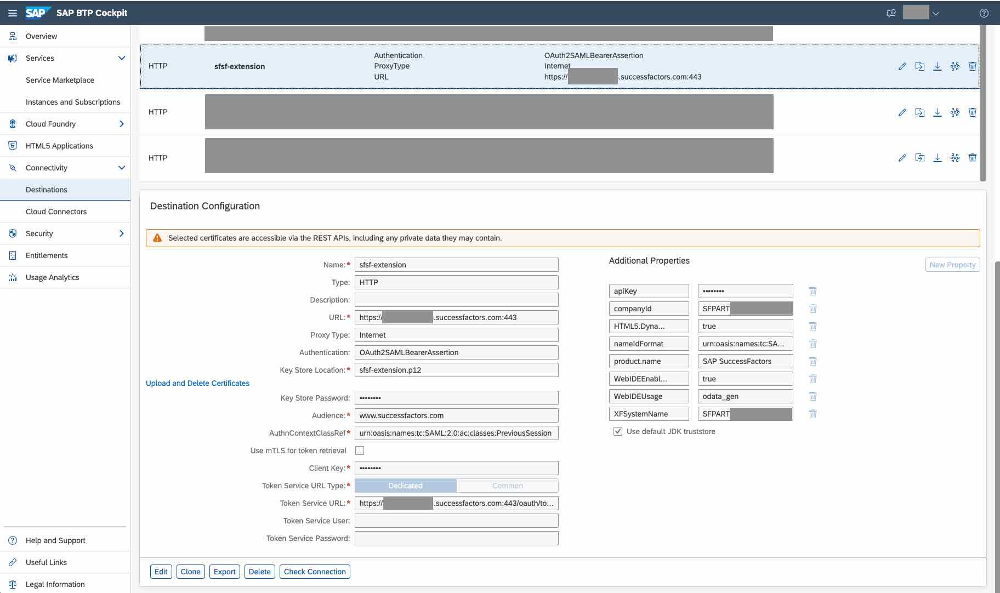

# **Bridge Framework - SAP SuccessFactors Principal Propagation**

Steps involved in establishing principal propagation between Bridge Framework and SAP SuccessFactors:

1. [Establish trust between SAP BTP and Microsoft Azure](./btp-azure-trust.md).
2. [Establish Trust with SAP BTP using SAP SuccessFactors Extensibility Service](#establish-trust-with-sap-btp-using-sap-successfactors-extensibility-service).

&nbsp;

## Establish Trust with SAP BTP using SAP SuccessFactors Extensibility Service

NOTE: The SAP SuccessFactors Extensibility Service is not available in all regions and is not currently available in trial accounts.
If the service is not available you may have to configure the trust between SAP BTP and SAP SuccessFactors manually.

1. Check if the service is available in your global account. Navigate to your global account and check the `Service Assignments` in the left navigation bar. If `SAP SuccessFactors Extensibility` is available you should be able to use it across your various subaccounts.

2. Navigate to `Entity Assignments` in the left navigation bar. Use the `Select Entities` search bar to select your subaccount.

3. Add `SAP SuccessFactors Extensibility` as a service to your chosen subaccount. Ensure that you select both the `api-access` and `sso-configuration` plans.

4. Follow this guide, **[SAP SuccessFactors instance setup](https://blogs.sap.com/2022/02/17/sap-ms-teams-5-sap-successfactors-instance-setup/)**, to establish trust between SAP BTP and SAP SuccessFactors.

5. After successfully following the guide in the previous step, the `SAP SuccessFactors Extensibility` will have automatically configured a destination you can use as an endpoint for integrations. Ensure that the `nameIdFormat` contains the following `urn:oasis:names:tc:SAML:1.1:nameid-format:emailAddress`. This will ensure that the user's email in BTP will be associated with their user in SuccessFactors. The destination should look something like this:

