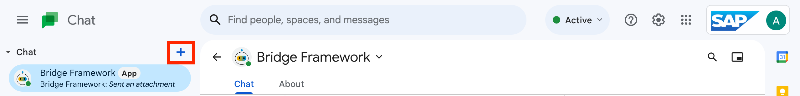

# **Bridge Framework - Deployment**

Follow the below steps to configure and deploy Bridge Framework to enable integration app in the Google Chat.

- [Configure Bridge Framework](#configure-bridge-framework)
- [Deploy Bridge Framework](#deploy-bridge-framework)

## Configure Bridge Framework

Follow the below steps to configure Bridge Framework for SAP S/4HANA approval workflows in Google Chat.

1. Configure Backend Application.

   a. Rename the env file `/backend/env.example` to `.env'. <br/>
   b. Under Google Workspace section, update the values which are noted during the Google Cloud setup.

   ```
   GCPProjectID=<your-gcp-project-id>
   GCPBucketName=<your-gcp-storage-bucket-name>
   GCPConvRefPath=installationRef/references.json
   ```

   c. Under SAP section update your XSUAA client id and secret.

   ```
   xsuaaClientId=<your-xsuaa-client-id>
   xsuaaClientSecret=<your-xsuaa-client-secret>
   ```

   d. Under Bridge Framework section, update Frontend URL, Config server URL and the Business object URL.

   Update your cloud foundry region accordingly.

   ```
     # Frontend
    frontendUrl=https://bridge-framework-frontend.cfapps.<cf-region>.hana.ondemand.com
    frontendFallbackUrl=https://bridge-framework-frontend.cfapps.<cf-region>.hana.ondemand.com

    # Config server
    configServerUrl=https://bridge-framework-config.cfapps.<cf-region>.hana.ondemand.com

    # Object url
    businessObjectUrl="https://<s4hana-external-ip:port>/sap/bc/ui2/flp#PurchaseOrder-manage&/C_PurchaseOrderTP(PurchaseOrder='{PO_ID}',DraftUUID=guid'00000000-0000-0000-0000-000000000000',IsActiveEntity=true)"

   ```

   e. Goto the Bridge Framework config server at `/config/public/backend/objectMappingConfig.json`. Update your BTP destination name under `S4HanaOnPrem > Destination > PurchaseOrder > destinationName` and `S4HanaOnPrem > Destination > PurchaseOrderItem > destinationName`.

   f. Make sure the notification config at `/config/public/notification/notificationConfig.json` accurately maps the fields of the event from S/4HANA.

   Refer [Notification Config](../../config/NotificationConfig.md) document for more details on how to map fields of the event.

   g. Rename your gcp service key to `gcp-key.json` and copy it to `/backend/bots/GoogleWS/`.

2. Configure Frontend application.

   a. Rename `.env.example` file to `.env` and update the backend and config URLs.

   ```
    SKIP_PREFLIGHT_CHECK=true

    REACT_APP_CONFIG_URL=https://bridge-framework-config.cfapps.<cf-region>.hana.ondemand.com
    REACT_APP_BACKEND_URL=https://bridge-framework-backend.cfapps.<cf-region>.hana.ondemand.com
    REACT_APP_INTEGRATION_TYPE=googleChat

   ```

3. Deploy applications.

   a. Login to cloud foundry.

   ```
    cf api <cf-endpoint-of-subaccount>
    cf login
   ```

   b. Deploy config server.

   ```
       cd config
       cf push
   ```

   c. Deploy backend.

   ```
       cd backend
       cf push
   ```

   d. Deploy frontend.

   ```
       cd frontend
       sh build-and-push.sh
   ```

Note: If the required BTP services are not created beforehand, use the below commands to create the BTP services required by Bridge Framework.

```
    cf create-service application-logs lite bridge-framework-app-logger
    cf create-service connectivity lite bridge-framework-connectivity
    cf create-service destination lite bridge-framework-destination
    cf create-service xsuaa application bridge-framework-xsuaa -c "{\"xsappname\": \"bridge-framework-connectivity\", \"tenant-mode\": \"dedicated\"}"
    cf create-service-key bridge-framework-xsuaa default

```

&nbsp;

## Ready to go

Thats it! now login to your Google Chat account and install Bridge Framework app in your chat by using `+` button and search for `Bridge Framework`.


