# **Bridge Framework - GCP setup**

Follow the below steps to configure Google Cloud Platform for Bridge Framework.

- [Enable Google Chat API](#enable-google-chat-api)
- [Create service account](#create-service-account)
- [Create storage bucket](#create-storage-bucket)

&nbsp;

## Enable Google Chat API

Enable Google Chat API in your Google Cloud project by following the below steps.

1. Go to [Google Cloud Console](https://console.cloud.google.com), and search for API Library in the search bar. Make sure to select the project you want to use from the project selector.

   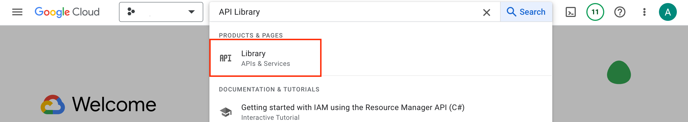

2. Search and select Google Chat API in the API Library.

   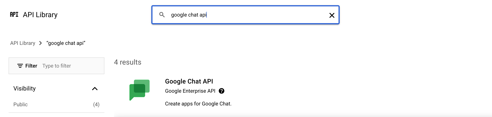

3. Enable the Google Chat API using `Enable` button.

   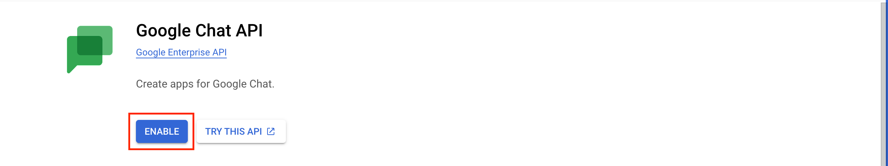

4. Configure the Chat integration developed using the Bridge Framework under `Configuration` tab of the Google Chat API.

   - App status: LIVE
   - App Name: `<str>;` Ex. Bridge Framework.
   - Avatar URL: Publicly hosted icon URL.
   - Description: `<str>;`. Ex. Enhance collaboration in Google Chat
   - Enable Interactive Features, Receive 1:1 messages, Join spaces and group conversations.
   - Connection Settings: Select `App URL`.
     - Ex: `https://<bridge-framework-backend-name>.cfapps.<btp-subaccouunt-region>.hana.ondemand.com`
   - Slash commands:

     - Name: /BridgeFramework
     - Command Id: 1
     - Description: `Open Bridge Framework`

   - Save all the settings using `Save` button.

   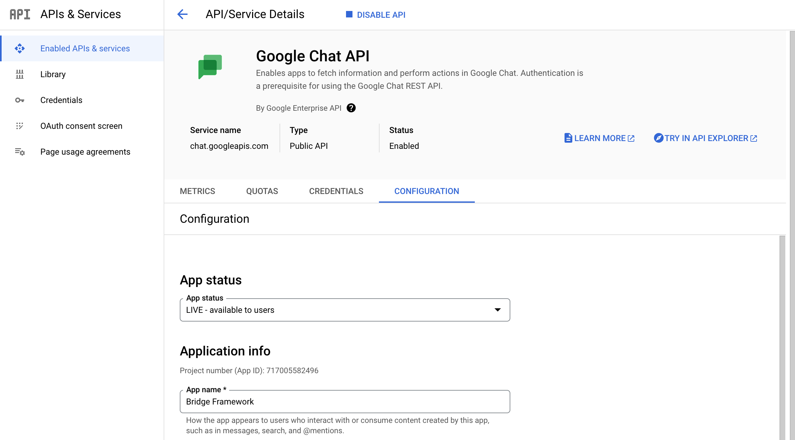

&nbsp;

## Create Service Account

Create a service account needed by the integration app by following the below steps.

1. In your [Google Cloud Console](https://console.cloud.google.com), search `IAM` to go to the Identity Access Management section.
   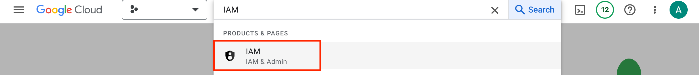

2. Select `Service Accounts` from the menu in the IAM section and click on `Create Service Account` button.
   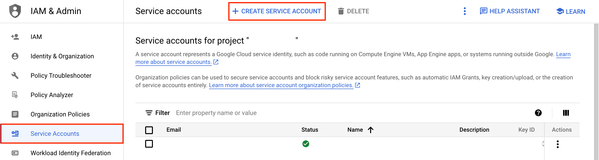

3. Name the service account in the `Service account details` section.
   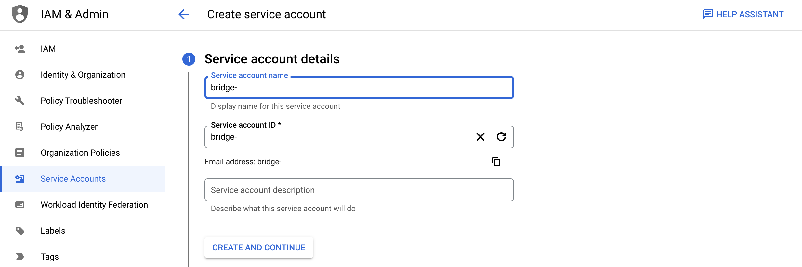

4. Assign the below two roles to the service account.

   - Chat Bots Owner
   - Storage Object Admin

   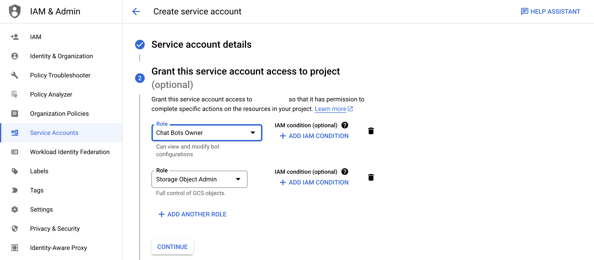

5. After the successful creation of the service account, add a JSON service key in the `Keys` section of the service account.
   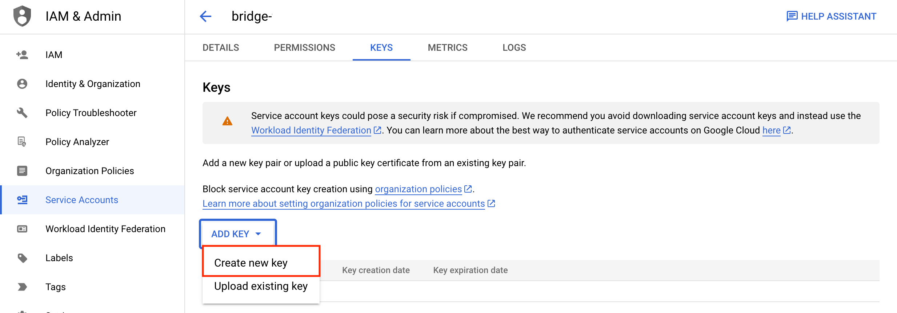

&nbsp;

## Create Storage Bucket

Create a Google Cloud storage bucket to store the references of the users who installed integration app in their Google Chat. The references are used to deliver notification to the recepients.

1. In the [Google Cloud Console](https://console.cloud.google.com), search `cloud storage` to find Google Cloud storage.
   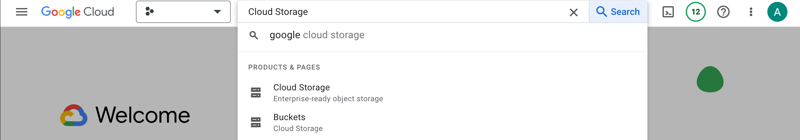

2. In the cloud storage section, create a storage bucket using `Create` button located at the top under `Buckets` section. Name the bucket appropriately and note down the name of the bucket to configure Bridge Framework later.
   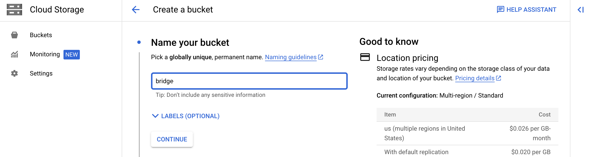

3. Select the `Location type` of the bucket to the `Region` (single region) option and select the location nearest to you.
   

4. Keep all the subsequent option to default and create the storage bucket.

5. After the successful bucket creation, go to the bucket and create a folder in the bucket and name the folder `installationRef`.
   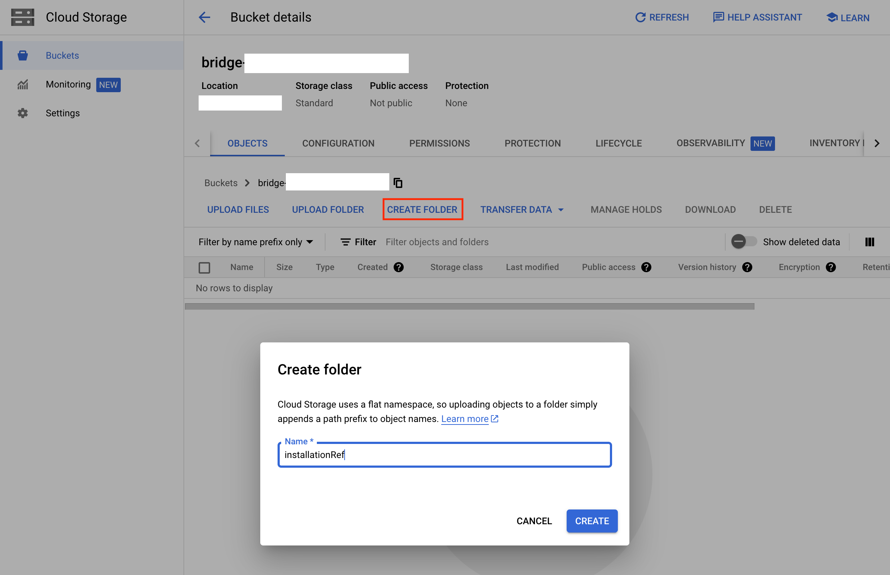

&nbsp;

## Next step

Follow [Bridge Framework setup](./deploy-app.md) to quickly setup and deploy Bridge Framework to create an integration app.
